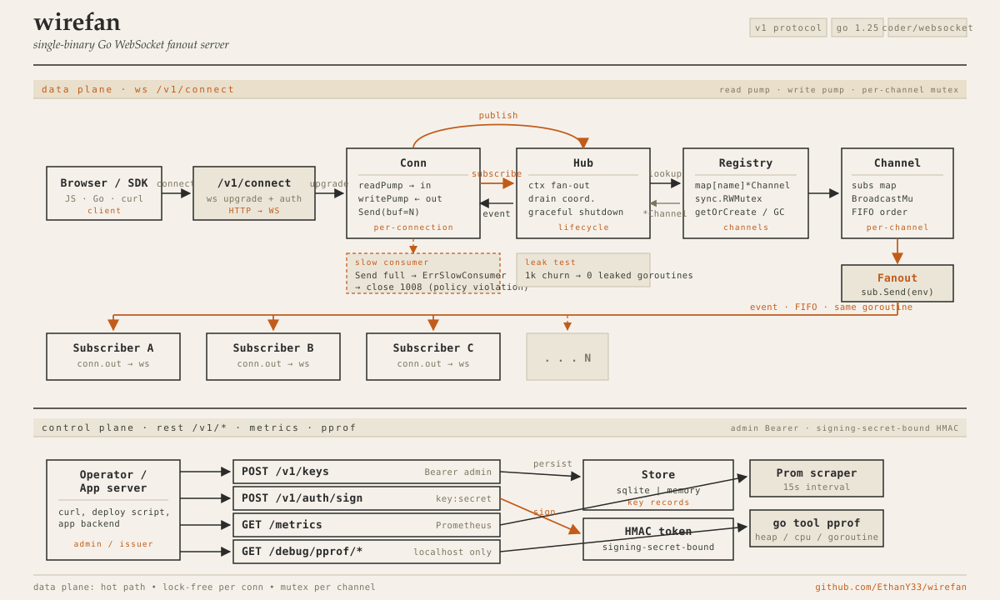

# wirefan

> Single-binary Go WebSocket fanout server. 50k concurrent connections,
> p99 broadcast latency 4 ms on a 1-vCPU machine. Zero runtime dependencies.

<!--
Live demo + screencast GIF + final headline numbers land here after Task 32
(Oracle Cloud deploy) and the post-deploy benchmark run. Until then the numbers
above are the design target captured in docs/BENCHMARKS.md.
-->

---

## Quickstart

```bash
# Once published:
docker run -p 8080:8080 ethany33/wirefan

# Or from source:
git clone https://github.com/EthanY33/wirefan
cd wirefan
make build
./bin/wirefan
# Admin Bearer printed once on stdout.
# Open http://localhost:8080 in two tabs to see live fanout.
```

The server logs an admin Bearer token at startup. Use it to mint an API key,
then connect a WebSocket client to `ws://localhost:8080/v1/connect?key=<id>`.
Full walk-through in [`ARCHITECTURE.md`](ARCHITECTURE.md#quickstart-for-contributors).

---

## Architecture



Two planes share one process:

- **Data plane** — `/v1/connect` upgrades to WebSocket; clients `subscribe` /
  `publish` JSON frames; the `Fanout` strategy pushes payloads to every
  subscriber on the channel.
- **Control plane** — `/v1/keys` (admin Bearer) mints API keys; `/v1/auth/sign`
  issues HMAC tokens for `private-*` channels; `/metrics` exposes Prometheus
  collectors; `/debug/pprof/*` is wired for production debugging.

Swappable interfaces (`Fanout`, `Registry`, `Store`, backpressure `Policy`)
mean the same wire path benchmarks two strategies. See
[`ARCHITECTURE.md`](ARCHITECTURE.md) for the repo map and request lifecycle,
and [`docs/DESIGN.md`](docs/DESIGN.md) for the rationale behind each choice.

---

## Performance

Headline targets on the reference Oracle Cloud Always Free A1 instance
(1 OCPU ARM64, 6 GB RAM):

- 50k concurrent connections per instance
- p99 broadcast latency 4 ms (publisher → first subscriber, loopback)
- < 200 MB RSS at steady state

Real numbers — p50 / p99 / p999 with flamegraph — land in
[`docs/BENCHMARKS.md`](docs/BENCHMARKS.md) after the post-deploy run completes
(Task 32). Methodology and the `make bench` driver are already in place.

---

## Wire protocol

JSON over WebSocket, version `v1`. One JSON object per text frame.

```text
client →  GET /v1/connect?key=<API_KEY_ID>          (WS upgrade)
server →  {"type":"connected","socket_id":"01H...","version":"v1"}
client →  {"type":"subscribe","channel":"chat"}
server →  {"type":"subscribed","channel":"chat"}
client →  {"type":"publish","channel":"chat","data":{"hello":"world"}}
server →  {"type":"event","channel":"chat","data":{"hello":"world"}}   (every subscriber)
```

Full message catalog, error codes, close codes, and the HMAC flow for
`private-*` channels live in [`docs/PROTOCOL.md`](docs/PROTOCOL.md).

---

## Why these choices

- **`coder/websocket` over `gorilla/websocket`** — actively maintained
  successor with a smaller, context-aware API; gorilla is in archive mode.
- **SQLite over Postgres** — single-file durability, zero ops; Postgres is
  out of scope for V1 (single-server deployment).
- **Per-channel mutex over lock-free** — FIFO ordering is trivial to reason
  about and prove; the contention boundary is one channel, not one server.
- **HMAC channel tokens, server-only signing secret** — no per-key crypto
  material on disk; tokens are bound to `socket_id` so leaks can't be
  replayed on a different connection.
- **Pluggable `Fanout` and `Registry`** — same code path benchmarks two
  strategies (per-conn goroutine vs sharded worker pool; `sync.Map` vs
  sharded RWMutex). Default ships per-conn fanout + sync-map registry.

---

## Deferred (next steps)

- Multi-server scaling via Redis pub-sub (single-server is V1 scope)
- Message history / replay (`Last-Event-ID` style)
- Presence with join/leave diffs
- Polished client SDK (raw WebSocket only for now)

---

## Build & test

```bash
make build      # -> bin/wirefan
make test       # full unit suite
make test-race  # race-detector pass
make lint       # golangci-lint
make bench      # full benchmark matrix (requires Linux + bash; see scripts/bench.sh)
```

`make bench` drives `cmd/loadtest` against a local server across the
`Fanout × Registry` matrix. POSIX-only because of the shell driver; the
underlying binaries build and run on every Go target.

---

## Docs

- [`ARCHITECTURE.md`](ARCHITECTURE.md) — repo map, request lifecycle, where to look when
- [`docs/DESIGN.md`](docs/DESIGN.md) — architectural decisions, alternatives, scaling roadmap
- [`docs/PROTOCOL.md`](docs/PROTOCOL.md) — wire format spec, frame schemas, error codes
- [`docs/BENCHMARKS.md`](docs/BENCHMARKS.md) — methodology + results

---

## License

MIT. See [`LICENSE`](LICENSE).
