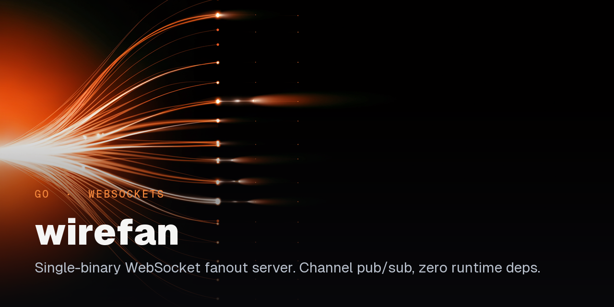

<p align="center">
  
</p>

<p align="center">
  <a href="https://github.com/EthanY33/wirefan/actions/workflows/ci.yml"></a>
</p>

# wirefan

> Single-binary Go WebSocket fanout server. Channel-based pub/sub,
> HMAC-bound subscribe tokens with replay protection, graceful drain,
> zero runtime dependencies. Goroutine-leak invariant proven under
> 1000-connection churn (`internal/server/leak_test.go`).

wirefan is a from-scratch, auditable single-process alternative to running
Centrifugo or soketi when what you need is channel fan-out with token auth,
not clustering, an admin UI, or multi-transport.

---

<!-- DEMO-GIF -->

## Quickstart

```bash
git clone https://github.com/EthanY33/wirefan
cd wirefan
go build -o bin/wirefan ./cmd/wirefan     # CGO required (sqlite driver)
./bin/wirefan --dev --allowed-origins='*'
```

The admin Bearer token is never printed. On first boot it is generated and
written to `var/admin.token` (override the directory with
`WIREFAN_STATE_DIR`, or supply the token directly via
`WIREFAN_ADMIN_TOKEN`); later boots reuse the same file. Use it to mint an
API key against the loopback admin listener:

```bash
ADMIN=$(cat var/admin.token)
curl -s -X POST http://127.0.0.1:6060/v1/keys \
  -H "Authorization: Bearer $ADMIN" \
  -H 'Content-Type: application/json' \
  -d '{"name":"dev"}'
# -> {"id":"01K...","name":"dev","secret":"..."}
```

Open `http://localhost:8080/?key=<id>` in two tabs to see live fanout, or
connect any WebSocket client to `ws://localhost:8080/v1/connect?key=<id>`.
Full walk-through in [`ARCHITECTURE.md`](ARCHITECTURE.md#quickstart-for-contributors).

---

## Architecture


Two planes share one process:

- **Data plane:** `/v1/connect` upgrades to WebSocket; clients `subscribe` and
  `publish` JSON frames; `hub.Broadcast` pushes each payload to every
  subscriber on the channel.
- **Control plane:** `/v1/keys` (admin Bearer) mints API keys; `/v1/auth/sign`
  issues HMAC tokens for `private-*` channels; a separate admin listener serves
  `/metrics` (Prometheus) and `/debug/pprof/*` for production debugging.

Swappable interfaces (`Fanout`, `Registry`, `Store`, backpressure `Policy`)
mean the same wire path benchmarks two strategies, selectable at boot with
`--fanout`, `--registry`, and `--store`. See
[`ARCHITECTURE.md`](ARCHITECTURE.md) for the repo map and request lifecycle,
and [`docs/DESIGN.md`](docs/DESIGN.md) for the rationale behind each choice.

---

## Performance

Numbers below are measured, not projected: each row traces to a raw output
file committed under `results/`, produced by `scripts/bench.sh` driving
`cmd/loadtest` against the server in a CPU-constrained Docker container
(`--cpus=1 --memory=6g`, amd64, Windows/WSL2 host, loadtest on the host over
loopback). The load generator spreads publishers across a pool of API keys
so the per-key rate limiter is never the thing being measured. Full
methodology and the exact reproduction commands are in
[`docs/BENCHMARKS.md`](docs/BENCHMARKS.md).

<!-- BENCH-RESULTS -->

Reproduce with:

```bash
docker build -t wirefan:dev -f deploy/Dockerfile .
bash scripts/bench.sh
```

What's verified in the test suite, independent of hardware:

- Goroutine-leak invariant: 1000-connection churn under `-race` returns to
  baseline within tolerance (`internal/server/leak_test.go`).
- Per-subscriber FIFO ordering: each connection's buffered send channel
  preserves order (Go guarantees send order equals receive order). `Broadcast`
  snapshots subscribers under `RLock` then sends concurrently, so per-channel
  total ordering is intentionally not a protocol guarantee (see the rationale
  below).
- Graceful shutdown: 30 s drain, `WaitGroup`-tracked goroutines, no leaks
  (covered by `internal/server/shutdown_test.go`).

---

## Wire protocol

JSON over WebSocket, version `v1`. One JSON object per text frame.

```text
client →  GET /v1/connect?key=<API_KEY_ID>          (WS upgrade)
server →  {"type":"connected","socket_id":"01H...","version":"v1"}
client →  {"type":"subscribe","channel":"chat"}
server →  {"type":"subscribed","channel":"chat"}
client →  {"type":"publish","channel":"chat","data":{"hello":"world"}}
server →  {"type":"event","channel":"chat","data":{"hello":"world"}}   (every subscriber)
```

Full message catalog, error codes, close codes, and the HMAC flow for
`private-*` channels live in [`docs/PROTOCOL.md`](docs/PROTOCOL.md).

---

## Why these choices

- **`coder/websocket`, not `gorilla/websocket`.** The actively maintained
  successor, with a smaller, context-aware API. gorilla is in archive mode.
- **SQLite, not Postgres.** Single-file durability, zero ops. Postgres is
  out of scope for V1 (single-server deployment).
- **Concurrent broadcast, not a per-channel lock.** `Broadcast` snapshots
  subscribers under `RLock` then sends concurrently. Each connection's buffered
  channel keeps its own order, so per-subscriber FIFO holds. A per-channel
  broadcast mutex was removed because one slow consumer head-of-line-blocked the
  whole channel under the disconnect policy's write deadline.
- **HMAC channel tokens with a server-only signing secret.** No per-key crypto
  material on disk, and tokens are bound to `socket_id` so a leak can't be
  replayed on a different connection.
- **Pluggable `Fanout` and `Registry`.** The same code path benchmarks two
  strategies (per-conn goroutine vs sharded worker pool; `sync.Map` vs
  sharded RWMutex), selected at boot with `--fanout=per-conn|sharded` and
  `--registry=sync-map|sharded`. The default ships per-conn fanout with a
  sync-map registry.

---

## Deferred (next steps)

- Multi-server scaling via Redis pub-sub (single-server is V1 scope)
- Message history and replay (`Last-Event-ID` style)
- Presence with join/leave diffs
- Polished client SDK (raw WebSocket only for now)

---

## Build and test

```bash
make build      # -> bin/wirefan
make test       # full unit suite
make test-race  # race-detector pass
make lint       # golangci-lint
make bench      # full benchmark matrix (requires Linux + bash; see scripts/bench.sh)
```

`make bench` drives `cmd/loadtest` against a local server across the
`Fanout × Registry` matrix. POSIX-only because of the shell driver; the
underlying binaries build and run on every Go target.

---

## Docs

- [`ARCHITECTURE.md`](ARCHITECTURE.md): repo map, request lifecycle, where to look when
- [`docs/DESIGN.md`](docs/DESIGN.md): architectural decisions, alternatives, scaling roadmap
- [`docs/PROTOCOL.md`](docs/PROTOCOL.md): wire format spec, frame schemas, error codes
- [`docs/BENCHMARKS.md`](docs/BENCHMARKS.md): methodology and results

---

## License

MIT. See [`LICENSE`](LICENSE).
