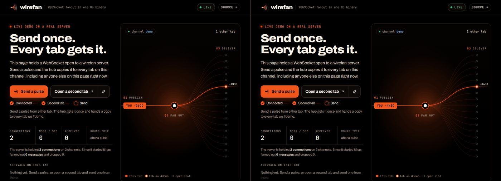
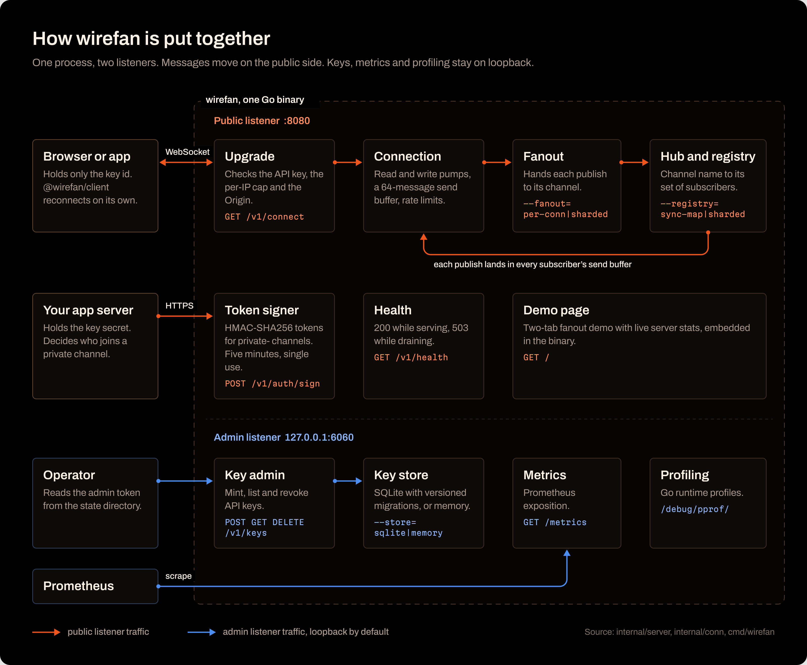
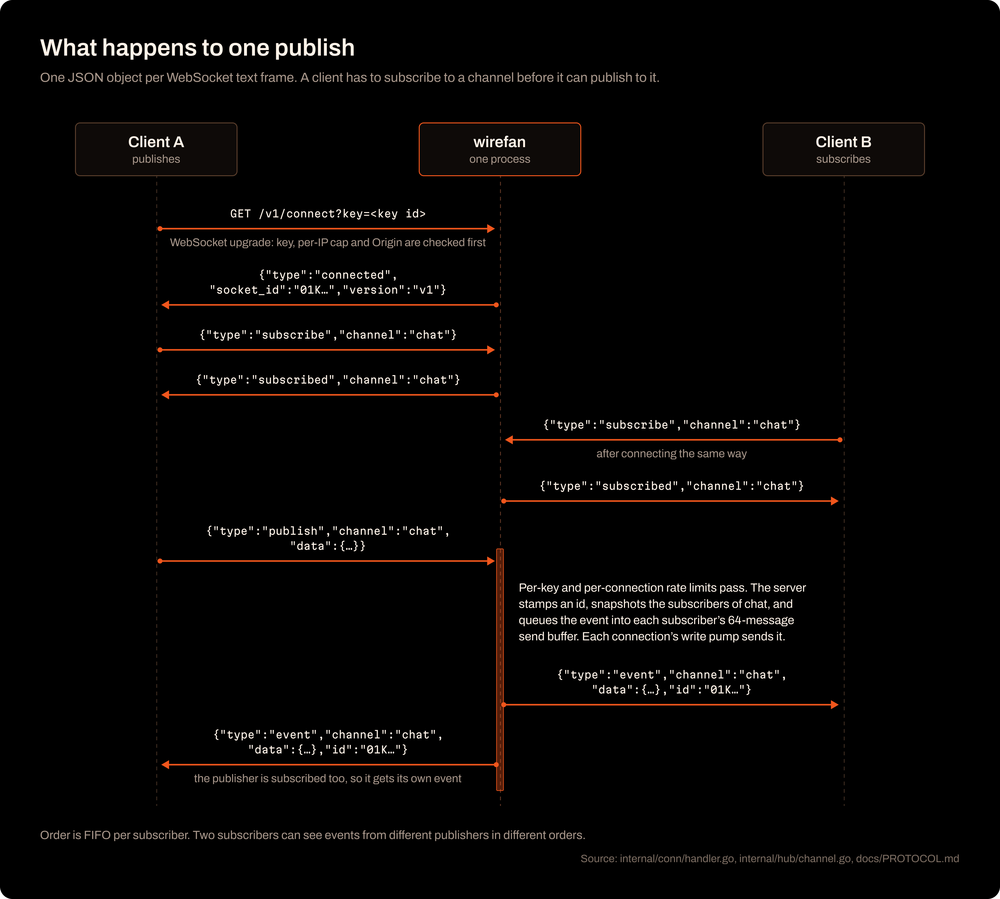
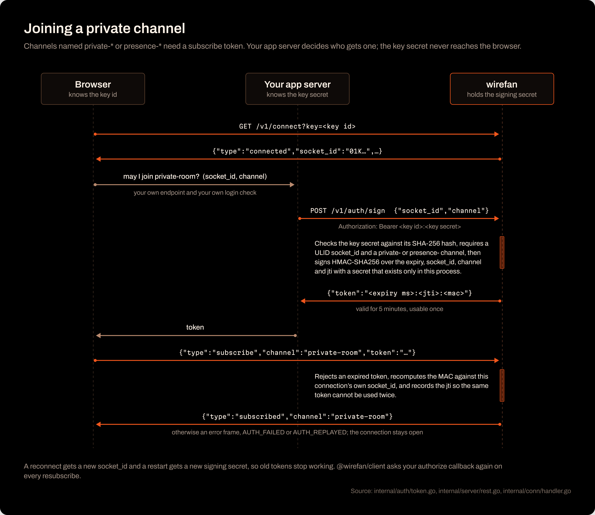
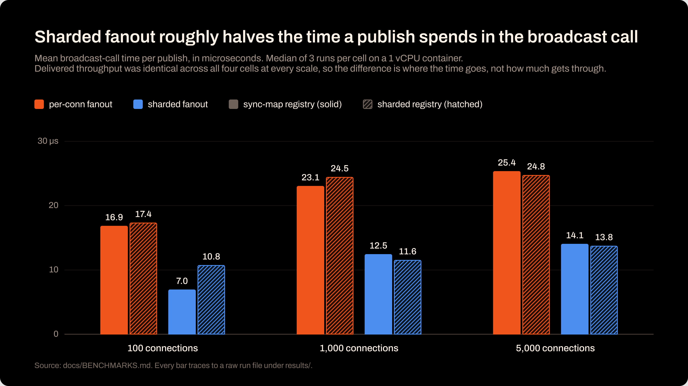
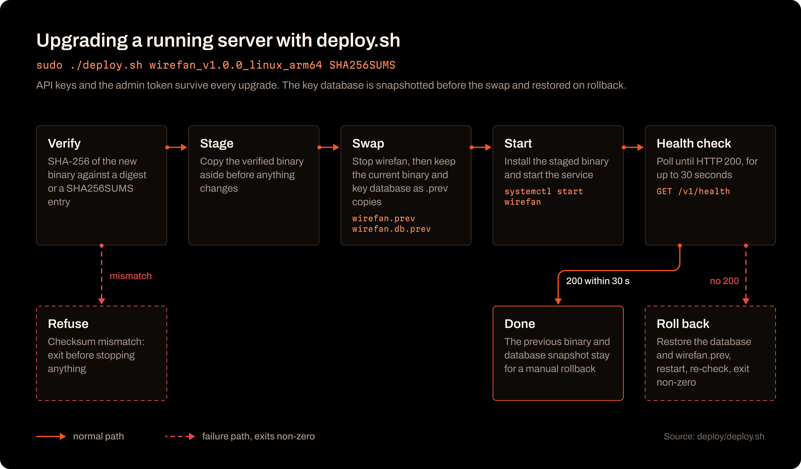
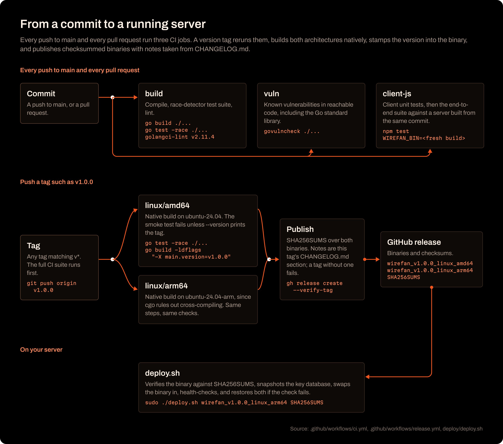

<p align="center">
  
</p>

<p align="center">
  <a href="https://github.com/EthanY33/wirefan/releases/latest"></a>
  <a href="https://github.com/EthanY33/wirefan/actions/workflows/ci.yml"></a>
  <a href="go.mod"></a>
  <a href="LICENSE"></a>
</p>

<p align="center">
  <a href="#install">Install</a> &nbsp;&middot;&nbsp;
  <a href="#quickstart">Quickstart</a> &nbsp;&middot;&nbsp;
  <a href="#how-it-works">How it works</a> &nbsp;&middot;&nbsp;
  <a href="#client-library">Client</a> &nbsp;&middot;&nbsp;
  <a href="#performance">Performance</a> &nbsp;&middot;&nbsp;
  <a href="#running-it-in-production">Deploy</a> &nbsp;&middot;&nbsp;
  <a href="docs/PROTOCOL.md">Protocol</a>
</p>

wirefan is a WebSocket fanout server in a single Go binary. Clients
subscribe to named channels; anything published to a channel reaches every
subscriber on it. Channels named `private-*` or `presence-*` need a
short-lived, single-use token that your own app server asks wirefan to sign,
so your login logic decides who joins them and the key secret never reaches
a browser.

It is a small, auditable alternative to running Centrifugo or soketi when
what you need is channel fanout with token auth, not clustering, an admin
UI, or several transports.

| | |
|---|---|
| **Protocol** | JSON over WebSocket, one object per frame, versioned `v1` ([spec](docs/PROTOCOL.md)) |
| **Auth** | API key per app; HMAC-SHA256 subscribe tokens bound to one connection and one channel, five-minute expiry, replay-protected |
| **Delivery** | FIFO per subscriber; a subscriber that cannot keep up is disconnected (1008) instead of stalling the channel |
| **Operations** | Prometheus metrics and pprof on a loopback admin listener, graceful drain, checksum-verified upgrades that roll back on a failed health check |
| **Footprint** | One binary for linux/amd64 and linux/arm64; API keys in an embedded SQLite file |
| **Stability** | [SemVer from 1.0](docs/COMPATIBILITY.md): protocol, HTTP API, flags and metric names are stable across 1.x |

<p align="center">
  
</p>

## Install

Linux binaries for amd64 and arm64 are attached to every
[release](https://github.com/EthanY33/wirefan/releases), next to a
`SHA256SUMS` file. The release notes list the minimum glibc each binary
needs.

```bash
VER=v1.0.0
ARCH=amd64            # or arm64; check with uname -m (aarch64 is arm64)
curl -fLO https://github.com/EthanY33/wirefan/releases/download/${VER}/wirefan_${VER}_linux_${ARCH}
curl -fLO https://github.com/EthanY33/wirefan/releases/download/${VER}/SHA256SUMS
sha256sum -c --ignore-missing SHA256SUMS
chmod +x wirefan_${VER}_linux_${ARCH}
./wirefan_${VER}_linux_${ARCH} --version
```

Building from source needs Go 1.26 and a C compiler, because the SQLite
driver uses cgo:

```bash
git clone https://github.com/EthanY33/wirefan && cd wirefan
make build            # or: go build -o bin/wirefan ./cmd/wirefan
```

## Quickstart

```bash
./bin/wirefan --dev --allowed-origins='*'
```

`--allowed-origins` is required; `*` is only accepted together with `--dev`.
The admin token is never printed. On first boot wirefan writes it to
`var/admin.token` (set `WIREFAN_STATE_DIR` to move it, or pass the token in
`WIREFAN_ADMIN_TOKEN`). Use it to mint an API key on the loopback admin
listener:

```bash
curl -s -X POST http://127.0.0.1:6060/v1/keys \
  -H "Authorization: Bearer $(cat var/admin.token)" \
  -H 'Content-Type: application/json' \
  -d '{"name":"dev"}'
# {"id":"01K...","name":"dev","secret":"..."}
```

Open `http://localhost:8080/?key=<id>` in two tabs to watch a message fan
out, or point any WebSocket client at `ws://localhost:8080/v1/connect?key=<id>`:

```text
client  GET /v1/connect?key=<id>                                   (upgrade)
server  {"type":"connected","socket_id":"01K...","version":"v1"}
client  {"type":"subscribe","channel":"chat"}
server  {"type":"subscribed","channel":"chat"}
client  {"type":"publish","channel":"chat","data":{"hello":"world"}}
server  {"type":"event","channel":"chat","data":{"hello":"world"},"id":"01K..."}
```

The secret is only needed for private channels. Keep it on your server.

## How it works

<p align="center">
  
</p>

One process runs two listeners. The public one (`--listen`, default `:8080`)
carries WebSocket traffic, token signing, the health check and the demo
page. The admin one (`--admin-addr`, default `127.0.0.1:6060`) carries key
administration, `/metrics` and `/debug/pprof/*`, and stays on loopback
unless you move it.

The interesting parts are swappable behind interfaces and chosen at boot,
so the same binary benchmarks both strategies:

- `--fanout=per-conn|sharded`: deliver inline on the publisher's goroutine,
  or hand off to a worker pool sized to `GOMAXPROCS`.
- `--registry=sync-map|sharded`: a `sync.Map` of channels, or 16
  `RWMutex`-guarded shards.
- `--store=sqlite|memory`: keys in SQLite with versioned, transactional
  migrations, or in memory for tests.

<p align="center">
  
</p>

A publish is rate-limited per connection and per API key, stamped with a
ULID, and copied into the send buffer of every subscriber on the channel.
Each connection has its own 64-message buffer and write pump, so one slow
reader cannot delay the others: when its buffer fills it is disconnected
with close code 1008 and everyone else keeps receiving.

<p align="center">
  
</p>

For private channels your app server is the gatekeeper. The browser asks it
for access; if your own login check passes, the app server calls
`POST /v1/auth/sign` with the key secret, and the browser subscribes with the
token it gets back. The token is bound to that connection's `socket_id` and
that channel, expires after five minutes, and works once. A reconnect gets a
new `socket_id` and a restart gets a new signing secret, so stale tokens stop
working on their own.

The full request lifecycle, repo map and "where to look when" guide are in
[`ARCHITECTURE.md`](ARCHITECTURE.md); the reasoning behind each choice is
in [`docs/DESIGN.md`](docs/DESIGN.md).

## Client library

[`clients/js`](clients/js) is `@wirefan/client`, a zero-dependency
TypeScript client for browsers and Node 22+. It reconnects with exponential
backoff and jitter, resubscribes every channel after a reconnect (asking your
`authorize` callback for fresh tokens, since tokens are single-use and bound
to a connection), and turns server error codes into typed errors. The demo
page above runs on it.

```js
import { WirefanClient } from "@wirefan/client";

const client = new WirefanClient({
  url: "wss://relay.example.com",
  key: "01K...",
  authorize: ({ socketId, channel }) =>
    fetch("/wirefan/token", { method: "POST", body: JSON.stringify({ socketId, channel }) })
      .then((r) => r.json())
      .then((j) => j.token),
});

await client.connect();
await client.subscribe("private-room", (ev) => console.log(ev.data));
client.publish("private-room", { hello: "world" });
```

It is not on npm yet; see [`clients/js/README.md`](clients/js/README.md) to
install it from the repo. Any WebSocket client works too: the protocol is
plain JSON.

## Performance

<p align="center">
  
</p>

Every number here traces to a raw output file under [`results/`](results),
produced by `scripts/bench.sh` driving `cmd/loadtest` against the server in
a Docker container limited to one CPU (`--cpus=1 --memory=6g`, amd64,
Windows/WSL2 host, load generator on the host over loopback). Each row is
the median-throughput run of three, and every run reconciles the load
generator's sent count against the server's own
`wirefan_messages_published_total`. Publishers are spread across a pool of
API keys so the per-key rate limit is never what gets measured.

Default configuration (`--fanout=per-conn --registry=sync-map`), ten
subscribers per channel, half the connections publishing:

| Connections | Channels | Rate per publisher | Delivered msg/s | Client p50 | Client p99 | Broadcast mean | Raw |
|---:|---:|---:|---:|---:|---:|---:|:---:|
| 500 | 50 | 10 msg/s | **23,568** | 1.06 ms | 6.68 ms | 20.5 us | [run](results/per-conn-sync-map-c500-rep3.txt) |
| 1,000 | 100 | 3 msg/s | 14,086 | 1.06 ms | 2.57 ms | 23.1 us | [run](results/per-conn-sync-map-c1000-rep3.txt) |
| 5,000 | 500 | 0.5 msg/s | 9,289 | 0.56 ms | 23.4 ms | 25.4 us | [run](results/per-conn-sync-map-c5000-rep2.txt) |

The rows use different publish rates (chosen so each scale's offered load
stays within what one CPU sustains cleanly), and the 5,000-connection row
used a 20 s ramp-up instead of 5 s, so delivered throughput is not
comparable down the column. 23,568 delivered messages per second is the
highest clean sustained rate measured on one vCPU with this harness. The
full Fanout x Registry matrix at 100, 1,000 and 5,000 connections, CPU and
heap profiles, and the exact commands are in
[`docs/BENCHMARKS.md`](docs/BENCHMARKS.md). To reproduce the 500-connection
row:

```bash
go build -o bin/loadtest ./cmd/loadtest
docker build -f deploy/Dockerfile -t wirefan:bench .
CONNS=500 CHANNELS=50 RATE=10 REPS=3 DURATION=30s CELLS="per-conn/sync-map" bash scripts/bench.sh
```

Proven by the test suite rather than by a benchmark, and run under the race
detector in CI:

- **No goroutine leaks.** After 1,000 connections churn, the server returns
  to its goroutine baseline under both fanout strategies, and again after
  key revocation and shutdown close every connection
  ([`internal/server/leak_test.go`](internal/server/leak_test.go)).
- **FIFO per subscriber.** Each connection's buffered send channel keeps
  its order. Broadcast snapshots the subscriber set and releases the lock
  before sending, so publishes to one channel are not serialized and total
  order across subscribers is deliberately not promised.
- **Graceful drain.** Shutdown closes every connection with 1001 and waits
  for them to deregister ([`internal/server/shutdown_test.go`](internal/server/shutdown_test.go)),
  and `/v1/health` answers 503 while draining
  ([`internal/server/health_test.go`](internal/server/health_test.go)).
- **Idle connections stay up.** A client that only answers pings is never
  dropped, including past the 60 second cutoff older versions had; one that
  stops answering is disconnected within about 40 seconds
  ([`internal/conn/pumps_test.go`](internal/conn/pumps_test.go)).
- **Revocation is immediate.** Revoking an API key closes that key's open
  connections with 1008 and refuses any that were mid-upgrade
  ([`internal/hub/hub_test.go`](internal/hub/hub_test.go)).

## Running it in production

<p align="center">
  
</p>

[`docs/DEPLOY.md`](docs/DEPLOY.md) takes a fresh Ubuntu 24.04 VPS from any
provider to a public `wss://` endpoint: DNS, firewall, a checksum-verified
release binary, one-command provisioning (`deploy/provision.sh` sets up the
service user, systemd unit and Caddy for TLS), the first API key, backups
and metrics. Upgrades go through `deploy/deploy.sh`, which verifies the new
binary against `SHA256SUMS`, keeps the previous binary and database, and puts
them back if the health check fails. Appendices cover Docker, a Cloudflare
Tunnel for machines without a public IP, and running behind Cloudflare's
proxy.

<details>
<summary><b>How a release is built</b></summary>
<br>
<p align="center">
  
</p>
</details>

## Why these choices

- **`coder/websocket`.** A context-aware API with a small surface, and
  actively maintained (it is the continuation of `nhooyr/websocket`).
- **SQLite, not a database server.** API keys are a small, rarely written
  table. One file, zero operations, and backups with `sqlite3 .backup`.
- **No per-channel broadcast lock.** Broadcast snapshots subscribers and
  releases the lock before sending, so a slow subscriber cannot hold up a
  publish to the same channel. The cost is that there is no total order
  across subscribers, only per subscriber.
- **A signing secret that never leaves the process.** It is generated at
  boot and held in memory, so there is no key material on disk to steal and
  a restart invalidates every outstanding token. Tokens are bound to one
  `socket_id`, so a leaked token cannot be replayed on another connection.
- **Swappable fanout and registry.** Two implementations of each, selected
  by flag, so the benchmark compares real binaries rather than hand-edited
  builds.

## Out of scope for 1.x

- Multiple wirefan processes sharing fanout (for example through Redis).
  1.x is one process by design.
- Message history and replay.
- Presence membership lists and join/leave events. The `presence-` prefix
  is reserved and token-protected today.
- Publishing `@wirefan/client` to npm.

## Development

```bash
make build        # bin/wirefan, version stamped from git describe
make test-race    # full suite under the race detector
make lint         # golangci-lint
make bench        # benchmark matrix; needs Docker and bash (Git Bash works on Windows)
cd clients/js && npm ci && npm test
```

See [`CONTRIBUTING.md`](CONTRIBUTING.md) for setup (cgo on Windows
included) and the invariants reviews check. Report security problems
privately as described in [`SECURITY.md`](SECURITY.md).

## Docs

| | |
|---|---|
| [`ARCHITECTURE.md`](ARCHITECTURE.md) | Repo map, request lifecycle, where to look when |
| [`docs/PROTOCOL.md`](docs/PROTOCOL.md) | Wire format, error and close codes, token format, limits |
| [`docs/DESIGN.md`](docs/DESIGN.md) | Architectural decisions and the alternatives considered |
| [`docs/DEPLOY.md`](docs/DEPLOY.md) | Production runbook for an Ubuntu 24.04 VPS |
| [`docs/BENCHMARKS.md`](docs/BENCHMARKS.md) | Methodology, full results and profiles |
| [`docs/COMPATIBILITY.md`](docs/COMPATIBILITY.md) | What SemVer covers from 1.0 on |
| [`clients/js/README.md`](clients/js/README.md) | `@wirefan/client` usage and reconnect semantics |
| [`CHANGELOG.md`](CHANGELOG.md) | Release notes |

The diagrams were designed in Figma and each one cites the source files it
was drawn from.

## License

MIT. See [`LICENSE`](LICENSE).
