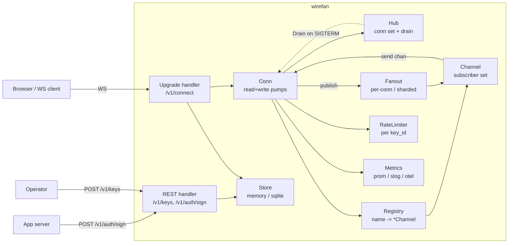
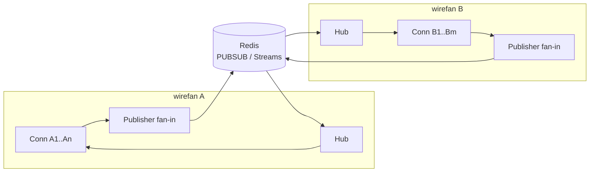

# wirefan — Design

> Engineer-to-engineer architecture deep-dive. Companion to
> [PROTOCOL.md](./PROTOCOL.md) (the wire contract) and
> [BENCHMARKS.md](./BENCHMARKS.md) (the performance contract). This
> doc covers the **why** — components, alternatives, and the
> decisions that close them out.

---

## 1. Introduction

wirefan is a single-binary Go WebSocket fan-out server: app backends
push JSON events; many browsers receive them on named channels. This
version (`v1`) is **single-process, single-host**. It is not a
distributed pub-sub bus, a chat product, or a Pusher drop-in. The
deliberate scope is "the smallest correct thing that demonstrates a
realtime backend at portfolio quality."

What it is, this version: one Go process; a public listener plus a
loopback admin listener; one sqlite file (or memory); WebSocket
upgrade at `/v1/connect`; REST control plane at `/v1/*`;
per-subscriber FIFO ordering (each subscriber sees any single
publisher's messages in publish order); three slow-consumer
backpressure strategies (default **disconnect**); two `Fanout` and
two `Registry` impls selectable at boot (`--fanout`, `--registry`)
for benchmark comparability.

What it isn't, by explicit non-goal (§14): not multi-server, not a
history store, not a presence service, not a client SDK, not a
Pusher-protocol drop-in.

The contract in one sentence: at-most-once JSON delivery on named
channels, per-subscriber FIFO from any single publisher, with bounded
memory and a principled answer for slow consumers.

---

## 2. Component overview



Each box is one Go package under `internal/`:

| Component   | Package                | Role                                                                 |
| ----------- | ---------------------- | -------------------------------------------------------------------- |
| Hub         | `internal/hub`         | Process-wide conn set; broadcasts close frames on shutdown drain.    |
| Channel     | `internal/registry`    | Per-channel subscriber set under `SubsMu` (RWMutex). Broadcast snapshot point. |
| Conn        | `internal/conn`        | Per-WS lifecycle: read pump, write pump, dispatch, policy hook.      |
| Fanout      | `internal/fanout`      | Interface + `PerConn` (inline) + `ShardedPool` (worker queues).      |
| Registry    | `internal/registry`    | Interface + `sync.Map` + 16-shard `RWMutex+map` impls.               |
| Auth        | `internal/auth`        | API key gen/hash + HMAC-SHA256 channel tokens.                       |
| Store       | `internal/store`       | Interface + `memory` + `sqlite` (WAL, BUSY=5s).                      |
| RateLimit   | `internal/ratelimit`   | `golang.org/x/time/rate` token bucket per `key_id` + GC loop.        |
| Metrics     | `internal/metrics`     | Prometheus collectors + dormant OTel hook.                           |
| Server      | `internal/server`      | HTTP wiring: `/v1/connect` upgrade, REST, `/v1/health`, `/metrics`.  |

Sources: `internal/{hub,conn,fanout,registry,auth,store,ratelimit,metrics,server}/`.

---

## 3. Concurrency model

The classic Go WebSocket pattern. The one place wirefan diverges from
the obvious design is the broadcast path: there is deliberately **no
per-channel broadcast lock**.

### 3.1 Per-subscriber FIFO, no channel-wide lock

```go
// internal/registry/registry.go
type Channel struct {
    Name        string
    SubsMu      sync.RWMutex
    Subscribers map[Subscriber]struct{}
    Deleted     atomic.Bool // set by the registry sweeper; see registry/sweep.go
}
```

The broadcast loop snapshots the subscriber set under a read lock,
releases it, then sends:

```go
// internal/hub/channel.go
func Broadcast(c *registry.Channel, msg []byte) {
    c.SubsMu.RLock()
    subs := make([]registry.Subscriber, 0, len(c.Subscribers))
    for s := range c.Subscribers {
        subs = append(subs, s)
    }
    c.SubsMu.RUnlock()
    for _, s := range subs {
        _ = s.Send(msg) // policy resolution lives at the conn layer
    }
}
```

`SubsMu` is an `RWMutex` so subscribe/unsubscribe (writers) don't
fight with the snapshot read inside `Broadcast`. Nothing serialises
two concurrent `Broadcast` calls on the same channel.

**What ordering survives.** Every `Send` pushes onto that
subscriber's buffered `chan []byte`, and Go guarantees chan-send
order equals chan-receive order; the subscriber's `writePump` drains
the chan in order. A single publisher's publishes are processed
sequentially on its own read goroutine, so each of its broadcasts
completes its `Send` to a given subscriber before the next begins.
Result: **per-subscriber FIFO from any single publisher**. Two
publishers racing on one channel may be observed in different orders
by different subscribers; that is not a protocol guarantee and never
was one a client could rely on portably. PROTOCOL.md §10 is the
authoritative user-visible statement.

**Why the lock was removed.** Early versions held a per-channel
broadcast mutex for the whole send loop, which upgraded the guarantee
to channel-wide total ordering. It was removed (commit `22fd26d`)
because serializing broadcasts turns one slow subscriber into a
head-of-line block for the entire channel: under `PolicyDisconnect`
a stalled peer can pin a `Send` for up to the write deadline, and
with the lock held that stall freezes every publisher and every
other subscriber on the channel for the duration. Trading an
ordering guarantee nobody's client could portably depend on for the
elimination of a cross-subscriber stall is the better contract.

### 3.2 Per-connection lifecycle

Each `Conn` owns two goroutines plus its own `send chan []byte` and a
`closeReq chan struct{}`. `Run` is the single owner; the pumps are
slaves.

```mermaid
sequenceDiagram
  participant Caller
  participant Run
  participant W as writePump
  participant R as readPump
  Caller->>Run: Run(ctx, ws, ...)
  Run->>Run: Hub.Add, send "connected"
  par
    Run->>W: go writePump(runCtx)
    Run->>R: go readPump(runCtx)
  end
  Note over Run: select { errc | closeReq | ctx }
  alt pump returns
    W-->>Run: errc<-err
    Run->>Run: cancel(); drain other pump
  else slow consumer
    Run->>Run: closeReq fires
    Run->>Run: ws.Close(1008)
    Run->>Run: cancel(); drain BOTH pumps
  end
  Run->>Run: closed.Store(true)
  Run->>Run: Hub.Unsubscribe all subs
  Run-->>Hub: Hub.Remove
  Run-->>Caller: return err
```

Key invariants from `internal/conn/conn.go`:

1. `Run` is the only goroutine that may block on `errc`. It picks the
   first pump to return, calls `cancel()`, and drains the other.
2. On a `closeReq` (slow-consumer signal from `Send`), `Run` calls
   `ws.Close(1008)` *before* `cancel()`, then drains *both* pumps because
   neither has reported yet. The order matters and is not the intuitive
   one: cancelling first fails `writePump`'s in-flight `Write` mid-frame,
   and coder/websocket then tears the conn down as an abnormal closure so
   the explicit 1008 never reaches the peer. Delivery of the 1008 is still
   best effort, since `ws.Close` needs the writer mutex that a stuck
   `writePump` may be holding inside a blocked TCP write, which is why
   `TestSlowConsumerDisconnects` asserts the behavior rather than the wire
   code (see `ecaec3b`).
3. `c.closed.Store(true)` fires *before* unsubscribing. Any in-flight
   `Broadcast` snapshot still pointing at this conn will see
   `closed == true` in `Send` and short-circuit to `ErrSlowConsumer`
   instead of pushing onto a chan that nobody will ever drain.
4. Empty channels are not deleted inline on unsubscribe (TOCTOU with
   a concurrent `GetOrCreate`). Instead a background sweeper
   (`registry.SweepLoop`, started in `cmd/wirefan/main.go: run`)
   removes channels that have lost all subscribers; it marks
   `Channel.Deleted` under `SubsMu`, and `hub.Subscribe` re-checks
   that flag under the same lock so a racing subscribe never lands
   on an orphaned channel reference.

### 3.3 Hub-level drain on shutdown

`Hub` is just a tracked set of `closer` interfaces:

```go
// internal/hub/hub.go
type closer interface {
    CloseFrame(code websocket.StatusCode, reason string)
}
```

`Hub.Drain(ctx, grace)` snapshots the set, calls `CloseFrame(1001,
"shutdown")` on each, and polls until either the conn count hits
zero, ctx is cancelled, or `grace` elapses. This is what
`Server.Run` calls after flipping `/v1/health` to 503 on SIGTERM:

```go
// internal/server/server.go
s.health.SetDraining(true)
shutdownCtx, cancel := context.WithTimeout(ctx2, 30*time.Second)
defer cancel()
s.hub.Drain(shutdownCtx, 30*time.Second)
return s.srv.Shutdown(shutdownCtx)
```

### 3.4 Goroutine-leak invariant

`internal/server/leak_test.go` proves the lifecycle: 1 000 connect/
disconnect churn under `-race`, then `runtime.NumGoroutine()` must
return to baseline (tolerance 30, for httptest and CI runner noise;
a real per-conn leak would show as ~2 000) within a 10-second
deadline. This is the load-bearing proof that nothing in the conn
lifecycle holds a goroutine reference past close.

---

## 4. Pluggable interfaces

Three of wirefan's internal seams are interfaces with two
implementations. The reason is not framework-style flexibility — it's
**benchmark comparability** and **scope reduction**. We commit to one
default and ship the alternative behind a flag (`--fanout`,
`--registry`, `--store` in `cmd/wirefan/main.go`) so the
BENCHMARKS.md matrix can show the trade-off rather than asserting it.

### 4.1 `Fanout` — `internal/fanout/`

```go
type Fanout interface {
    Broadcast(ctx context.Context, channel *registry.Channel, msg []byte)
}
```

| Impl              | Flag                | When it wins                                                       |
| ----------------- | ------------------- | ------------------------------------------------------------------ |
| `PerConn`         | `--fanout=per-conn` | Default. Inline call from publisher's read goroutine — zero extra hops. |
| `ShardedPool`     | `--fanout=sharded`  | Fixed worker pool, FNV-shard by `channel.Name`; overlaps broadcasts across cores when many channels are hot. |

`PerConn` is one line: `hub.Broadcast(c, msg)`. It runs on the
publisher's goroutine. Latency is best when publishers are sparse
relative to channels.

`ShardedPool` decouples publish from broadcast: each broadcast becomes
a `job` enqueued onto one of `workers` queues, sharded by channel
name. A small worker pool drains queues and runs the actual
`hub.Broadcast`. This trades a hop and a buffered chan for the
ability to overlap broadcasts across CPU cores when many channels
are hot simultaneously.

Either way the ordering story is unchanged: both impls funnel through
`hub.Broadcast`, and per-subscriber FIFO is preserved by each
subscriber's buffered send chan (§3.1), not by the dispatch strategy.

### 4.2 `Registry` — `internal/registry/`

```go
type Registry interface {
    GetOrCreate(name string) *Channel
    Lookup(name string) (*Channel, bool)
    Delete(name string)
    Range(fn func(*Channel) bool)
    Len() int
}
```

| Impl       | Flag                  | When it wins                                                              |
| ---------- | --------------------- | ------------------------------------------------------------------------- |
| `SyncMap`  | `--registry=sync-map` | Default. Read-heavy workloads, mostly-stable channel set.                 |
| `Sharded`  | `--registry=sharded`  | Mostly-write or churning channel sets: 16 fixed shards, RWMutex per shard. |

`SyncMap` uses Go's `sync.Map`, which is optimised for read-mostly
maps with stable keys. Channels are typically created once and read
many times per broadcast, so this is a near-perfect match.

`Sharded` keeps a fixed array of `RWMutex+map[string]*Channel` shards
(FNV32a hash, modulo 16). It wins on workloads that churn the
channel set or have very high concurrent `GetOrCreate` rate, where
`sync.Map`'s read+miss+upgrade dance becomes the bottleneck.

### 4.3 `Store` — `internal/store/`

```go
type Store interface {
    CreateKey(ctx, name, secretHash string) (Key, error)
    LookupKey(ctx, id string) (Key, error)
    ListKeys(ctx) ([]Key, error)
    RevokeKey(ctx, id string) error
    Close() error
}
```

| Impl     | Flag             | When it wins                                                          |
| -------- | ---------------- | --------------------------------------------------------------------- |
| `SQLite` | `--store=sqlite` | Default. WAL journal, `_busy_timeout=5000`, single file at `--db-path`. |
| `Memory` | `--store=memory` | Tests, hermetic benchmark cells, "throwaway key" ephemeral demo mode. |

`Store` is small on purpose: keys only. Channel state is in-memory
because a multi-host wirefan would need a different design entirely
(see §8). API keys are the one thing that has to survive a restart.

---

## 5. Auth model

Two layers: REST-control-plane API keys, and per-channel HMAC tokens
issued by the operator's app server.

### 5.1 API keys (Bearer for REST, key_id-only for WS)

`auth.GenerateSecret` produces 32 bytes of `crypto/rand` hex.
`auth.HashSecret` is a `sha256` of the secret. The store keeps only
the hash. `auth.VerifySecret` uses `crypto/subtle.ConstantTimeCompare`.

REST endpoints take `Authorization: Bearer <admin_token>` for
`/v1/keys` (served on the loopback admin listener), and
`Authorization: Bearer <key_id>:<secret>` for `/v1/auth/sign`. The
admin token is never printed: it is read from `WIREFAN_ADMIN_TOKEN`
if set, else persisted at `<state-dir>/admin.token` (mode 0600,
reused across restarts; see `cmd/wirefan/main.go:
resolveAdminToken`). WS upgrade takes `?key=<key_id>` only — the
secret never crosses the browser.

### 5.2 HMAC channel tokens

`private-*` channels require a token. `auth.SignToken` produces a
three-part value:

```
<expMs>:<jti>:<base64url(HMAC_SHA256(secret, "<expMs>|<socket_id>|<channel>|<jti>"))>
```

The MAC binds the token to the issuing connection's `socket_id`, so a
leaked token cannot be replayed on a different connection. The `jti`
(16 random bytes, hex) is inside the MAC payload and is recorded by a
per-server `auth.ReplayCache` on first successful verify, making each
token single-use even on its own connection; a swept background loop
evicts expired entries. TTL is 5 min, asserted before the signature
check by `auth.VerifyTokenAgainst`.

### 5.3 Why a separate signing secret (option b)

Two designs were on the table for the HMAC source:

- **(a)** Per-key secret — each `key_id` has a long-term shared
  secret used both as a Bearer credential and as the HMAC key.
- **(b)** Server-wide signing secret, regenerated on each boot, used
  only for tokens. (Chosen.)

Option (b) wins for three reasons:

1. **Key rotation independence.** Rotating an API key does not
   invalidate every outstanding HMAC token in the wild. Tokens are
   already short-lived (5 min); their signing key has its own
   lifetime.
2. **Constrained blast radius.** A leaked API secret lets an attacker
   sign their own tokens; a leaked signing secret lets them only
   *forge* tokens, which still need a valid `key_id` and a matching
   live `socket_id` to be useful.
3. **No client confusion.** The browser never sees the signing
   secret; it lives only on the operator's app server (which calls
   `/v1/auth/sign`) and inside wirefan. Two different audiences,
   two different secrets — clean.

The signing secret is in-memory only and printed nowhere; loss of the
secret across restarts means tokens issued before the restart fail.
This matches the 5-min TTL story and is acceptable for v1.

### 5.4 `?key=<id>` vs `Sec-WebSocket-Protocol` bearer

Query-string credentials on `/v1/connect` show up in proxy access
logs. wirefan accepts the trade-off (Pusher does too). The
alternative — stuffing the key into `Sec-WebSocket-Protocol`,
JSON-decoded — works in browsers but adds protocol surface (subprotocol
negotiation) for no clear gain at this scope. Rejected for protocol
simplicity. The defence in depth here is the per-source-IP
connection cap (`defaultIPCap = 200` in
`internal/server/upgrade.go`, overridable via the `WIREFAN_IP_CAP`
env var), key revocation, and the fact that `?key=<id>` is *not* a
bearer token — the secret is not in the URL.

One scoping note on the origin check: `--allowed-origins` is a
browser-only speed bump (a non-browser client can send any `Origin`
header it likes). The real access control is the API key plus the
socket-bound HMAC token; the origin allowlist just stops casual
cross-site embedding of the public endpoint.

---

## 6. Persistence trade-offs

wirefan's only persistent state is API keys.

- **SQLite (default, `--store=sqlite`).** Single file at `--db-path`
  (default `<state-dir>/wirefan.db`), WAL journal, 5 s busy timeout.
  Zero ops. Backups are `cp wirefan.db wirefan.db.bak`. The
  `mattn/go-sqlite3` driver is the only cgo dep; it's stable and
  well-known. We pay the cgo cost once at build time, not at runtime.
- **Memory (`--store=memory`).** Used for tests, hermetic benchmark
  cells, and the "ephemeral demo" mode where keys vanish on restart.
- **Postgres.** Considered, rejected for v1. Postgres would need a
  connection pool, a migration tool, an ops story, and a TLS
  config. The benefit (multi-host shared keystore) is irrelevant
  while wirefan is single-host.

Channel state (subscribers, pending sends) is **deliberately not
persisted**. A subscriber's lifetime is its WebSocket; a publisher's
event is at-most-once by design.

### Schema versioning and migrations

The SQLite store versions its schema with `PRAGMA user_version` and an
ordered, append-only migration list in `internal/store/migrate.go`.
Each migration runs in a single transaction that also bumps
`user_version`, so a crash mid-migration rolls back the schema change
and the version bump together: a crash never leaves the database
between versions. The transaction is opened with `BEGIN IMMEDIATE` and
re-reads `user_version` after taking the write lock, so two processes
racing to open the same file (restart overlap, rolling deploy) apply
each migration at most once; the loser sees the bumped version and
skips.

The upgrade contract:

- **Version 0 means "pre-versioning", not "empty".** Databases created
  by v0.2.0 have `user_version = 0` and already contain the keys
  table. Migration 1 (the baseline) adopts such a database in place
  without touching its rows; on a genuinely empty database it creates
  the table fresh. Both starting states converge on the same version-1
  schema. A version-0 database that contains any other table, or a
  `keys` table whose columns and constraints do not match the v0.2.0
  shape, is refused: it is not a file wirefan created, and migrating
  it would write wirefan's table into a foreign database and clobber
  its `user_version`.
- **Refusals are read-only.** An existing file is inspected over a
  query-only preflight connection before the writable WAL handle is
  opened, so a refused file is left byte-for-byte unmodified (the WAL
  handle would otherwise rewrite the journal-mode header bytes as a
  side effect of opening).
- **Forward only.** A database whose `user_version` is newer than the
  binary understands is refused with an explicit error. Silently
  running an old binary against a future schema could misread or
  corrupt it; the fix is to upgrade wirefan, not downgrade the file.
- **Migrations are append-only.** Shipped migrations are never edited
  or reordered; new schema changes get the next version number, and
  the runner rejects a list whose versions are not contiguous from 1,
  so a copied step with an unbumped version fails loudly instead of
  silently never running.

The list currently contains only the baseline migration, because no
post-v0.2.0 schema change has been needed yet. The runner's multi-step
ordering, crash rollback, and resume behavior are covered by tests in
`internal/store/migrate_test.go`.

---

## 7. Wire-format trade-offs

JSON over text WebSocket frames. PROTOCOL.md is the authoritative
spec; this is the *why*.

- **JSON.** Debuggable in browser devtools, no codegen, no schema
  registry, every WebSocket client can parse it. The CPU cost of
  `encoding/json` is well below the wire bandwidth of the broadcast
  path; profiles confirm this is not the hot spot.
- **MessagePack / Protobuf — rejected.** Both would buy maybe 30%
  bandwidth on small payloads in exchange for codegen, schema
  versioning, and worse dev-tools UX. wirefan's bottleneck at the
  scale of one vCPU is the broadcast loop and the per-conn write
  syscall, not the marshal step. Headroom is not the constraint.
- **Pusher protocol drop-in — rejected.** Borrowing Pusher's auth
  flow shape is fine. Cloning their wire (event names with dots,
  presence channel format, system events) would be compat-scope
  creep with no payoff for a portfolio project.

---

## 8. Alternatives considered

For each, what was on the table and why it was closed out.

### 8.1 `gorilla/websocket` instead of `coder/websocket`

**Rejected.** `gorilla/websocket` was archived for years; the
community successor is `coder/websocket` (formerly `nhooyr.io/websocket`).
Same browser compat, leaner API (`Read`/`Write` with context
deadlines, no manual `SetReadDeadline` plumbing), and active
maintenance. Adopting it costs nothing and ages better.

### 8.2 Redis pub-sub for multi-server

**Deferred.** Multi-host scaling is an explicit non-goal for v1.
Adding Redis would mean: pub-sub topic per channel, dedup of locally-
originated messages, a sticky-session story (or a per-message
ordering token), and a dependency on a network service. The single-
host scope is deliberate; measured single-host numbers live in
BENCHMARKS.md. §12 sketches what multi-host would look like.

### 8.3 Custom epoll loop (`gnet`, `nbio`)

**Rejected.** The modern Go scheduler handles goroutine counts far
beyond wirefan's single-host scope; per-goroutine runtime cost is not
the bottleneck at our target scale (measured numbers in
BENCHMARKS.md). `gnet`/`nbio` trade away the *entire* idiomatic Go
I/O stack for a smaller per-conn footprint and tighter tail latency
wirefan does not yet need. Premature.

### 8.4 WebTransport / HTTP/3

**Deferred.** Browser support remains uneven in 2026 (Chromium-family
shipping, Firefox/Safari behind flags or absent). The fan-out
semantics don't change; this is purely a transport-layer story.
Worth revisiting once Safari ships.

### 8.5 Sticky sessions for multi-server

**Deferred.** Layer-7 sticky sessions (cookie-pinned WebSockets) are
the obvious answer if you want N wirefan instances behind one LB.
They don't solve cross-instance fan-out by themselves — you still
need Redis pub-sub or equivalent. Filed under §12 as part of the
multi-host design sketch, not a v1 feature.

---

## 9. Backpressure

Three policies, defined in `internal/conn/policy.go`:

| Policy             | Behaviour when send chan (cap 64) is full                           |
| ------------------ | ------------------------------------------------------------------- |
| `PolicyDisconnect` | **Default.** Returns `ErrSlowConsumer`; conn closes with 1008.     |
| `PolicyDropOldest` | Pops the head of the chan, pushes the new message. Never errors.   |
| `PolicyDropNewest` | Drops the new message. Never errors.                               |

Why disconnect is the default: in a fan-out broadcaster, a slow
subscriber is a *correctness* problem, not just a throughput
problem. If we silently drop, the subscriber's view of the channel
is no longer FIFO from any individual publisher's point of view —
they're missing messages but don't know which. Disconnect lets the
client reconnect with a clean slate; it's a clear signal, not a
silent corruption. This is the standard "correctness over availability
for slow consumers" trade. The drop policies are exposed for
operators who genuinely want lossy semantics (telemetry stream,
metrics, "best effort" channels).

Drops increment `wirefan_messages_dropped_total{reason="slow_consumer"}`.
The disconnect path also emits a 1008 close, which is observable on
the client.

The signal path from `Send` to disconnect is non-blocking via a
buffered `closeReq chan struct{}` of size 1: multiple concurrent
`Send` failures collapse into a single close request, and `Run`
drains both pumps before tearing down the WS.

---

## 10. Resource limits

Every limit exists to bound a specific failure mode. Sources:
`internal/conn/conn.go`, `internal/conn/pumps.go`,
`internal/server/upgrade.go`, `cmd/wirefan/main.go`.

| Limit                           | Value         | Bounds…                                                  |
| ------------------------------- | ------------- | -------------------------------------------------------- |
| Max inbound frame size          | 64 KiB        | Per-conn memory; runaway publish payloads.               |
| Max channels per connection     | 64            | Single-conn worst case for the registry.                 |
| Max subscribers per channel     | 10 000        | Per-broadcast iteration cost; fans out into N×64 send chans. |
| Send chan size                  | 64            | Per-conn buffered queue depth before backpressure trips. |
| Publish rate, sustained / burst | 100/s / 200   | Per `key_id`. Spam protection across all conns sharing a key. |
| Active conns per source IP      | 200 (`WIREFAN_IP_CAP`) | Phantom-conn / runaway-tab bound.               |
| Token TTL                       | 5 min         | Replay window.                                           |
| WS read deadline                | 60 s          | Idle / dead-peer detection. Combined with 30 s ping.     |
| WS write deadline               | 10 s          | Stalled-peer write detection.                            |
| Hub drain grace                 | 30 s          | Graceful shutdown ceiling.                               |

Soft vs hard:

- *Soft* (returns an error frame, conn stays open):
  `LIMIT_CHANNELS`, `LIMIT_SUBSCRIBERS`, `RATE_LIMITED`,
  `RESERVED_CHANNEL`.
- *Hard* (closes the conn): frame size (1009), slow consumer (1008),
  read deadline (1001), drain (1001).

Store, registry, and fanout selection plus the per-IP cap are already
runtime-configurable (`--store`, `--registry`, `--fanout`,
`WIREFAN_IP_CAP`); the conn-level constants above remain compile-time
values in `internal/conn/conn.go`. PROTOCOL.md §9 lists the source of
truth.

---

## 11. Observability

Three layers, all opt-in at the network edge.

- **Prometheus** — `internal/metrics/prom.go`. Singletons registered
  via `sync.Once` (so test suites that boot multiple servers don't
  trip `MustRegister`'s panic). Exposed at `/metrics`.
  - `wirefan_connections_total` (gauge)
  - `wirefan_channels_total` (gauge — placeholder; wired with
    `_wirefan-stats` channel)
  - `wirefan_messages_published_total` (counter)
  - `wirefan_messages_dropped_total{reason}` (counter)
  - `wirefan_broadcast_latency_seconds` (histogram, exp buckets
    starting at 100µs)
  - `wirefan_upgrade_rejected_total{reason}` (counter)
  - `wirefan_auth_failures_total` (counter)
- **slog** — structured logs to stdout. `slog.Default()` is the
  emitter; the operator picks the handler at boot.
- **pprof** — `/debug/pprof/*` is mounted on the separate admin
  listener (`--admin-addr`, default `127.0.0.1:6060`) together with
  `/metrics` and `/v1/keys`, so neither profiling nor key management
  is reachable through the public listener or a misconfigured
  ingress. Keep the admin listener on loopback or an internal VLAN.
- **OTel** — `internal/metrics/otel.go`. Returns a no-op shutdown
  when `endpoint == ""` (the production default). Handing in an
  OTLP HTTP endpoint activates the tracer provider; we don't ship
  spans yet — the hook is dormant until publish-path / handler
  spans land in a follow-up.

The `_wirefan-stats` system channel (`hub.PublishStatsLoop`) emits a
periodic JSON snapshot to subscribers. This is visible from any
WebSocket client and serves as a simple "live metrics" surface for
the demo, no Prometheus scrape required.

---

## 12. Scaling roadmap

Sketches only; none of this is implemented in v1.

### 12.1 Redis pub-sub for multi-host fanout



The shape:

- Every publish goes to Redis tagged with an `origin_node` and a
  monotonically-increasing per-node sequence number.
- Every node subscribes to every channel topic; on receive, it
  fans out to its local subscribers via the existing `Fanout`.
- Dedup: each node remembers a small ring of `(origin_node, seq)`
  it has seen; messages it just published locally don't double-fire.
- Ordering across nodes is best-effort — a sticky-session LB pins
  any one *publisher* to one node so per-publisher FIFO holds.
  Cross-publisher ordering remains undefined (consistent with v1).

Open questions, all in §13.

### 12.2 Presence

The two viable shapes are:

- **CRDT presence.** Each node maintains an OR-Set of `socket_id`s
  subscribed per channel; gossip / Redis-broadcast joins and leaves;
  reconcile periodically. Eventually consistent, no central
  authority, fits the multi-host roadmap.
- **Per-channel ring buffer.** Last N joins/leaves stored per channel.
  Simpler; can be served via REST.

Likely a dedicated channel type (`presence-*`) with explicit
join/leave events on the wire, mirroring Pusher's model but minimal.

### 12.3 History / replay

`Last-Event-ID`-style. The current `event.id` is already a ULID
(monotonically sortable per publisher per wall-clock tick). A small
per-channel ring buffer of the last N events plus a `replay_from`
field on `subscribe` would let a reconnecting client backfill. Out
of scope for v1.

---

## 13. Open questions

- **Sticky vs stateless multi-server.** Sticky LB + Redis fan-out is
  the pragmatic answer; fully stateless requires either a router
  layer or every-node-listens-to-every-topic with bounded fanout.
  Trade-off TBD when multi-host is on the table.
- **Presence model.** CRDT vs ring-buffer above. Don't decide until
  there's a real first user.
- **OTel active vs dormant.** Currently dormant. Deciding which
  spans to emit (per-publish? per-handler? per-broadcast inner
  loop?) waits on real production traffic — premature spans add
  cost without info.
- **Pusher-protocol compat.** Some protocol shapes (presence-* events,
  `pusher:ping`) are well-trodden. Adopting them would let Pusher
  client SDKs work unchanged; doing so creeps the spec. Deferred.
- **Channel-state GC cadence.** A sweeper (`registry.SweepLoop`)
  already deletes channels that have lost all subscribers. Whether
  the fixed sweep interval should become adaptive (or flag-tunable)
  under high channel churn is open.

---

## 14. Out of scope

Copied from the spec to keep this doc self-contained:

- Multi-server scaling (Redis pub-sub, etc.)
- Message history / replay
- Presence with join/leave diffs
- Client-side SDK (raw WS only)
- WebTransport / HTTP/3 transport
- MessagePack / Protobuf wire formats
- Custom epoll/kqueue event loop (gnet, nbio)
- Pusher-protocol drop-in compatibility
- Exactly-once / ordered delivery across reconnects

These exist as deliberate non-goals to bound the v1 scope. Anything
on this list that becomes interesting later gets its own design
document, not a quiet feature add.

---

## 15. References

- [PROTOCOL.md](./PROTOCOL.md) — authoritative wire-protocol spec.
- [BENCHMARKS.md](./BENCHMARKS.md) — methodology and headline numbers.
- `docs/superpowers/specs/2026-05-04-relay-fanout-server-design.md` —
  the original locked spec this implementation tracks against.
- `internal/conn/conn.go` — the `Run` lifecycle and pump
  coordination invariants discussed in §3.2.
- `internal/hub/channel.go` — the lock-free broadcast snapshot and
  per-subscriber FIFO rationale of §3.1.
- `internal/server/leak_test.go` — the goroutine-leak proof of §3.4.
