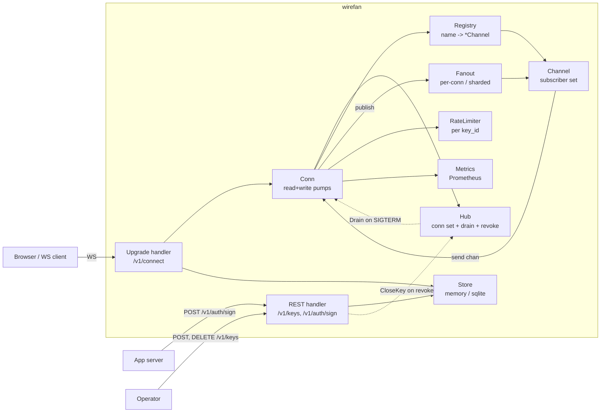
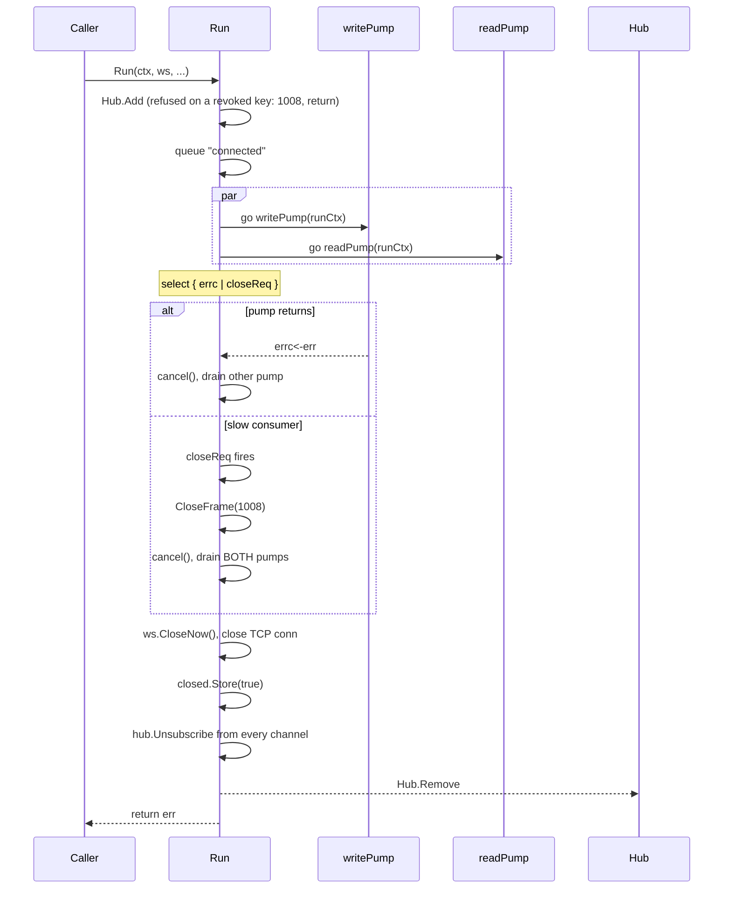
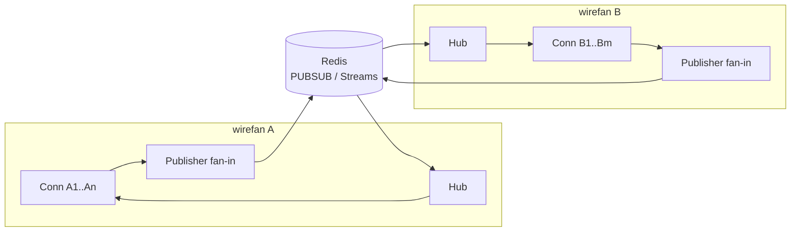

# wirefan design

> Engineer-to-engineer architecture deep-dive. Companion to
> [PROTOCOL.md](./PROTOCOL.md) (the wire contract),
> [BENCHMARKS.md](./BENCHMARKS.md) (the performance contract) and
> [COMPATIBILITY.md](./COMPATIBILITY.md) (what 1.x promises). This
> doc covers the **why**: components, alternatives, and the
> decisions that close them out.

---

## 1. Introduction

wirefan is a single-binary Go WebSocket fan-out server: app backends
push JSON events; many browsers receive them on named channels. 1.x
is **single-process, single-host**. It is not a distributed pub-sub
bus, a chat product, or a Pusher drop-in. The deliberate scope is
"the smallest correct thing that demonstrates a realtime backend at
portfolio quality."

What it is, in 1.x: one Go process; a public listener plus a
loopback admin listener; one sqlite file (or memory); WebSocket
upgrade at `/v1/connect`; REST control plane at `/v1/*`;
per-subscriber FIFO ordering (each subscriber sees a single
publisher's messages on a single channel in publish order); three
slow-consumer backpressure policies, of which a shipped binary uses
**disconnect** (§9); two `Fanout` and two `Registry` impls selectable
at boot (`--fanout`, `--registry`) for benchmark comparability.
Beside the server, `clients/js` holds `@wirefan/client`, a TypeScript
client SDK (0.1.0, not yet published to npm, versioned separately
from the server per COMPATIBILITY.md). Its vendored build,
`web/wirefan-client.js`, drives the demo page.

What it isn't, by explicit non-goal (§14): not multi-server, not a
history store, not a presence service, not a Pusher-protocol drop-in.

The contract in one sentence: at-most-once JSON delivery on named
channels, per-subscriber FIFO for any single publisher on a single
channel, with bounded memory and a defined answer for slow consumers.

---

## 2. Component overview



Each box maps to a Go package under `internal/` (some packages hold
two boxes, and `internal/auth` has none of its own):

| Component   | Package                | Role                                                                 |
| ----------- | ---------------------- | -------------------------------------------------------------------- |
| Hub         | `internal/hub`         | Process-wide conn set; sends close frames on shutdown drain and key revocation. |
| Channel     | `internal/registry`    | Per-channel subscriber set under `SubsMu` (RWMutex). Broadcast snapshot point. |
| Conn        | `internal/conn`        | Per-WS lifecycle: read pump, write pump, ping/pong liveness, dispatch, per-conn rate limits, policy hook. |
| Fanout      | `internal/fanout`      | Interface + `PerConn` (inline) + `ShardedPool` (worker queues).      |
| Registry    | `internal/registry`    | Interface + `sync.Map` + 16-shard `RWMutex+map` impls; empty-channel sweep. |
| Auth        | `internal/auth`        | API key gen/hash, HMAC-SHA256 channel tokens, jti replay cache.      |
| Store       | `internal/store`       | Interface + `memory` + `sqlite` (WAL, BUSY=5s, versioned schema).    |
| RateLimit   | `internal/ratelimit`   | `golang.org/x/time/rate` token bucket per `key_id` + GC loop.        |
| Metrics     | `internal/metrics`     | Prometheus collectors and the `_wirefan-stats` snapshot.             |
| Server      | `internal/server`      | HTTP wiring: public listener (`/v1/connect`, `/v1/auth/sign`, `/v1/health`, demo page) and admin listener (`/v1/keys`, `/metrics`, `/debug/pprof/*`). |

Sources: `internal/{hub,conn,fanout,registry,auth,store,ratelimit,metrics,server}/`.
The client SDK is outside the Go module's packages: TypeScript in
`clients/js/src/index.ts`, vendored into `web/wirefan-client.js` with
`npm run vendor:web`.

---

## 3. Concurrency model

The classic Go WebSocket pattern. The one place wirefan diverges from
the obvious design is the broadcast path: there is deliberately **no
per-channel broadcast lock**.

### 3.1 Per-subscriber FIFO, no channel-wide lock

```go
// internal/registry/registry.go
type Channel struct {
    Name        string
    SubsMu      sync.RWMutex
    Subscribers map[Subscriber]struct{}
    Deleted     atomic.Bool // set by the registry sweeper; see registry/sweep.go
}
```

The broadcast loop snapshots the subscriber set under a read lock,
releases it, then sends:

```go
// internal/hub/channel.go
func Broadcast(c *registry.Channel, msg []byte) {
    c.SubsMu.RLock()
    subs := make([]registry.Subscriber, 0, len(c.Subscribers))
    for s := range c.Subscribers {
        subs = append(subs, s)
    }
    c.SubsMu.RUnlock()
    for _, s := range subs {
        _ = s.Send(msg) // policy resolution lives at the conn layer
    }
}
```

`SubsMu` is an `RWMutex` so subscribe/unsubscribe (writers) don't
fight with the snapshot read inside `Broadcast`, and it is released
before the first `Send`. Nothing serialises two concurrent `Broadcast`
calls on the same channel. The only lock a send takes is the
receiving connection's own `sendMu` in `Conn.Send`
(`internal/conn/handler.go`), held just for the policy's non-blocking
enqueue; under `PolicyDisconnect` a full buffer returns
`ErrSlowConsumer` at once and signals that connection to close with
1008 (§9).

**What ordering survives.** Every `Send` pushes onto that
subscriber's buffered `chan []byte`, and Go guarantees chan-send
order equals chan-receive order; the subscriber's `writePump` drains
the chan in order. A single publisher's publishes are handled
sequentially on its own read goroutine. Under `--fanout=per-conn`
each broadcast runs inline there, so it completes its `Send` to a
given subscriber before the next begins. Under `--fanout=sharded`
the read goroutine only enqueues, but a channel always maps to the
same worker queue, and one worker drains that queue in order (§4.1).
Result: **per-subscriber FIFO for a single publisher on a single
channel**. Across channels there is no guarantee: under the sharded
pool, one publisher's messages to two channels can go to different
workers and reach a subscriber of both out of order. Under the default
per-conn fanout, two publishers racing on one channel may be observed in
different orders by different subscribers (the sharded pool's single
worker per channel happens to serialize them, but clients cannot tell
which fanout a server runs); total order is not a protocol guarantee and never
was one a client could rely on portably. PROTOCOL.md §10 is the
authoritative user-visible statement.

**Why the lock was removed.** Early versions held a per-channel
broadcast mutex for the whole send loop, which upgraded the guarantee
to channel-wide total ordering. That lock (`BroadcastMu`) was removed in commit `22fd26d`; the
`SubsMu.RLock` snapshot and the send loop were already there and are
unchanged. The commit message's stated reason is that a stalled
subscriber could pin a `Send` for up to the 10 s write deadline and,
with the lock held, freeze the channel. That was never the mechanism
(the comment on `hub.Broadcast` was corrected in `0db27fc`): `Send`
does not wait on the peer.
`PolicyDisconnect.Apply` is a non-blocking select (it already was at
`22fd26d`), and the write deadline applies only inside the
subscriber's own `writePump`. A stalled subscriber fills its own send
chan and is disconnected (§9). What the lock did cost is
serialization: every `Broadcast` on a channel waited for the previous
one's whole loop over up to 10 000 subscribers, so under
`--fanout=per-conn` concurrent publishers on a hot channel queued
behind each other on their read goroutines and that channel's sends
could not spread across cores. (Under `--fanout=sharded` one worker
per channel serializes the loops anyway, §4.1.) Giving up an
ordering guarantee no client could portably depend on in exchange
for that parallelism is the better contract.

### 3.2 Per-connection lifecycle

Each `Conn` owns two goroutines plus its own `send chan []byte` and a
`closeReq chan struct{}`. `Run` is the single owner; the pumps report
to it.



`Run`'s select has no `ctx` case: cancellation of the caller's
context reaches `Run` through the pumps, which return when `runCtx`
(derived from it) is done.

Key invariants from `internal/conn/conn.go`:

1. `Run` is the only goroutine that may block on `errc`. It picks the
   first pump to return, calls `cancel()`, and drains the other.
2. On a `closeReq` (slow-consumer signal from `Send`), `Run` calls
   `CloseFrame(1008)` *before* `cancel()`, then drains *both* pumps
   because neither has reported yet. The order matters and is not the
   intuitive one: cancelling first fails `writePump`'s in-flight
   `Write` mid-frame, and coder/websocket then tears the conn down as
   an abnormal closure so the explicit 1008 never reaches the peer.
   Delivery of the 1008 is still best effort, since the close needs
   the writer mutex that a stuck `writePump` may be holding inside a
   blocked TCP write, which is why `TestSlowConsumerDisconnects`
   asserts the behavior rather than the wire code (see `ecaec3b`).
3. Every exit path releases the socket. Once both pumps have
   returned, `Run` calls `ws.CloseNow()` and closes the TCP
   connection. Before 1.0, the oversize-message (1009) path and other
   pump errors returned with the TCP connection still open and nobody
   reading it, and the per-IP slot was released anyway, so those
   sockets escaped the cap. It is `CloseNow` rather than `Close`
   because `Close`'s handshake discards the rest of a half-read
   oversize frame with no deadline.
4. Server-side close handshakes are bounded. coder/websocket limits
   writing the close frame and reading the reply (5 s each) but not
   discarding the rest of a frame the peer stopped sending half way,
   so a peer that stalls mid-frame could hold a server-side close,
   and its socket, open indefinitely. `CloseFrame` therefore arms a
   timer (`closeHandshakeTimeout`, 15 s) that closes the TCP
   connection under the handshake. `Run` can reach that connection
   because `server.New` sets `http.Server.ConnContext` to
   `conn.WithNetConn`, which puts it in the request context.
5. `c.closed.Store(true)` fires *before* unsubscribing. Any in-flight
   `Broadcast` snapshot still pointing at this conn will see
   `closed == true` in `Send` and short-circuit to `ErrSlowConsumer`
   instead of pushing onto a chan that nobody will ever drain.
6. Empty channels are not deleted inline on unsubscribe (TOCTOU with
   a concurrent `GetOrCreate`). Instead a background sweeper
   (`registry.SweepLoop`, every minute, started in
   `cmd/wirefan/main.go: run`) removes channels that have lost all
   subscribers. For each empty channel it holds `SubsMu` while it
   removes the channel with `CompareAndDelete` (only while the name
   still maps to that channel, so a fresh one is never evicted) and
   marks `Channel.Deleted`. `hub.Subscribe` checks that flag under the
   same lock; the subscriber then retries `GetOrCreate`, which can only
   return a fresh channel. Before 1.0 the sweep deleted marked channels
   only after its whole `Range`, so `GetOrCreate` kept handing a dead
   channel back for the rest of the pass and a racing subscribe could
   exhaust its retries. Now it fails with `SUBSCRIBE_FAILED` only if it
   loses the race three times in a row.

### 3.3 Hub: drain and key revocation

`Hub` is a tracked set of `trackedConn` values, which `*conn.Conn`
implements (1.0 renamed the interface from `closer` and added
`APIKeyID` and `CloseNow`):

```go
// internal/hub/hub.go
type trackedConn interface {
    APIKeyID() string
    CloseFrame(code websocket.StatusCode, reason string) // close handshake; can block
    CloseNow()                                           // no handshake; must not block
}
```

`Hub.Drain(ctx, grace)` marks the hub draining and snapshots the set in
one critical section, starts
`CloseFrame(1001, "shutdown")` on every conn concurrently, then polls
every 50 ms until the conn count hits zero or the sooner of `ctx` and
`grace` expires. Whatever is still tracked then gets `CloseNow`, which
sends nothing further: it cancels the run context and closes the TCP
connection, cutting off any unfinished handshake, so `Drain` returns
within its ctx. Before 1.0 it ran every close handshake one at a time
under the hub lock before it ever looked at ctx, so every peer that
never answered the handshake added about 5 s (coder/websocket's
handshake wait) to shutdown (`TestDrainNonReadingPeersHonorsCtx`).
`CloseNow` closes the TCP connection itself because `ws.CloseNow`
waits for a
running close handshake instead of interrupting it, and one stuck on
a peer that stalled mid-frame does not finish (invariant 4,
`TestDrainFreesSocketOfPeerStalledMidFrame`).

Once draining, `Hub.Add` refuses every conn with 1001 `"shutdown"`, the
same admission barrier `CloseKey` uses for revoked keys, and
`/v1/connect` answers 503 before any other check. Without the barrier a
shutdown never ended early: `@wirefan/client` redials a few hundred
milliseconds after a GoingAway, those conns were not in the snapshot, and
they held `Drain` open for the full grace before being force-closed
(`TestAddRefusedWhileDraining`, `TestUpgradeRefusedWhileDraining`).

`Server.Run` calls `Drain` after flipping `/v1/health` to 503 when
the root context is cancelled (SIGINT or SIGTERM), then shuts down
both listeners and closes the fanout:

```go
// internal/server/server.go
s.health.SetDraining(true)
s.hub.Drain(context.Background(), s.drainGrace) // 30 s
if s.adminSrv != nil {
    _ = s.shutdownListener(s.adminSrv) // its own 5 s budget
}
err := s.shutdownListener(s.srv)
if s.fan != nil {
    _ = s.fan.Close()
}
return err
```

Each listener gets its own 5 s budget after the drain, and running out
of it closes whatever HTTP connections remain instead of failing: when
the drain and the listeners shared one 30 s context, a drain that used
the whole window left `Shutdown` an expired context, `Run` returned
`context.DeadlineExceeded`, and `main` exited 1 on an ordinary stop
(`TestRunShutdownIsBoundedAndNotFatal`).

The fanout closes last because a conn that `Drain` force-closed can
still be inside a publish until its pumps exit. Closing the
`ShardedPool` earlier would let that publish land in a pool whose
`Broadcast` is a silent no-op after `Close`, while the publish is
still counted.

**Key revocation.** `Hub.CloseKey(keyID, code, reason)` closes every
tracked conn opened with `keyID`, each handshake in its own goroutine
so the revoke request never waits on a slow peer, and records the key
so that `Hub.Add` refuses any later conn on it for the life of the
process. `DELETE /v1/keys/{id}` calls it with 1008 `"key revoked"`
after the store marks the key revoked (§5.1). The record closes a
race the store check alone leaves open: an upgrade that looked its
key up just before the revoke and reached `Hub.Add` just after would
be missed by the sweep and stay open. `Add` checks under the same
lock `CloseKey` sweeps under, so every conn is either in the sweep or
refused, and `Run` sends a refused conn the same 1008 close itself.
The record is never pruned: a revoked key cannot be restored, and key
ids are small.

### 3.4 Goroutine-leak invariant

`internal/server/leak_test.go` proves the lifecycle.
`TestNoGoroutineLeakAfterChurn` runs 1 000 connect/disconnect cycles,
once under each fanout, then requires `runtime.NumGoroutine()` to
return to baseline (tolerance 30, for httptest and CI runner noise;
a real per-conn leak would show as ~2 000) within a 10-second
deadline. `TestNoGoroutineLeakAfterHubCloses` does the same for the
hub's goroutine-spawning close paths: `Hub.CloseKey` on 100 conns,
100 upgrades that `Hub.Add` refuses on the closed key, then
`Hub.Drain` on 100 more. CI runs both under `-race`. Together they are
the load-bearing proof that nothing in the conn lifecycle holds a
goroutine reference past close. `ShardedPool` worker exit after
`Close` is proven separately (`TestShardedPoolWorkersExitOnClose` in
`internal/fanout`).

---

## 4. Pluggable interfaces

Three of wirefan's internal seams are interfaces with two
implementations. The reason is not framework-style flexibility; it is
**benchmark comparability** and **scope reduction**. We commit to one
default and ship the alternative behind a flag (`--fanout`,
`--registry`, `--store` in `cmd/wirefan/main.go`). `--fanout` and
`--registry` are the axes of the BENCHMARKS.md matrix, so it runs real
binaries rather than hand-edited builds. The matrix shows the fanout
trade-off rather than asserting it; the registry one does not show up
at its channel-churn rate and remains design intent (§4.2). `--store`
is not a benchmark axis: it picks durable keys (`sqlite`) or a
throwaway in-memory set for tests, benchmark cells and ephemeral demos
(§4.3).

### 4.1 `Fanout` (`internal/fanout/`)

```go
type Fanout interface {
    Broadcast(ctx context.Context, channel *registry.Channel, msg []byte)
    Close() error
}
```

| Impl              | Flag                | When it wins                                                       |
| ----------------- | ------------------- | ------------------------------------------------------------------ |
| `PerConn`         | `--fanout=per-conn` | Default. Inline call from publisher's read goroutine; zero extra hops. |
| `ShardedPool`     | `--fanout=sharded`  | Worker pool sized to `GOMAXPROCS`, FNV-shard by `channel.Name`; overlaps broadcasts across cores when many channels are hot. |

`PerConn` is one line: `hub.Broadcast(c, msg)`. It runs on the
publisher's goroutine and adds no hop or queue; the cost is that the
publisher's read goroutine does the whole send loop. Its `Close` is a
no-op.

`ShardedPool` decouples publish from broadcast: each broadcast becomes
a `job` enqueued onto one of `workers` queues (capacity 1024 each;
`Broadcast` blocks while its queue is full), sharded by channel name.
One worker per queue drains it and runs the actual `hub.Broadcast`.
This trades a hop and a buffered chan for the ability to overlap
broadcasts across CPU cores when many channels are hot
simultaneously. `Close` stops accepting broadcasts, closes the queues
and waits for the workers to finish what was already enqueued;
`Broadcast` after `Close` is a no-op (§3.3 covers the shutdown order
that makes this safe).

Ordering: both impls funnel through `hub.Broadcast`, and each
subscriber's send chan keeps the order its `Send`s arrive in (§3.1).
The dispatch strategy decides that order. `PerConn` runs a
publisher's broadcasts inline and in sequence, so one publisher's
messages keep their order even across channels. `ShardedPool` keeps
same-channel order only because a channel always hashes to the same
worker queue and one worker drains each queue in order; one
publisher's messages to two channels can land on different workers
and reach a common subscriber out of order. The protocol promises
only the same-channel case (PROTOCOL.md §10).

### 4.2 `Registry` (`internal/registry/`)

```go
type Registry interface {
    GetOrCreate(name string) *Channel
    Lookup(name string) (*Channel, bool)
    Delete(name string)
    CompareAndDelete(name string, c *Channel) bool
    Range(fn func(*Channel) bool)
    Len() int
}
```

| Impl       | Flag                  | When it wins                                                              |
| ---------- | --------------------- | ------------------------------------------------------------------------- |
| `SyncMap`  | `--registry=sync-map` | Default. Read-heavy workloads, mostly-stable channel set.                 |
| `Sharded`  | `--registry=sharded`  | Mostly-write or churning channel sets: 16 fixed shards, RWMutex per shard. |

`SyncMap` uses Go's `sync.Map`, which is optimised for read-mostly
maps with stable keys. A publish never touches the registry: it takes
the `*Channel` from the conn's own subscription map. A channel is
created by its first subscribe, and after that the registry is read by
later subscribes to the same name (`GetOrCreate`), by the sweeper's
`Range` (§3.2, invariant 6), by the stats loop's `GetOrCreate` every
5 s and by `Len` for the `wirefan_channels` gauge. The read-mostly fit
therefore comes from subscribe traffic on a stable channel set, not
from broadcasts.

`Sharded` keeps a fixed array of `RWMutex+map[string]*Channel` shards
(FNV32a hash, modulo 16). It is meant for workloads that churn the
channel set or have a very high concurrent `GetOrCreate` rate, where
`sync.Map`'s read+miss+upgrade path would become the bottleneck.
That is design intent, not a measured result: the BENCHMARKS.md
matrix creates channels once and cannot separate the two registries.

`CompareAndDelete` exists for the sweeper (§3.2, invariant 6), which
calls it from inside `Range`. So `Sharded.Range` calls `fn` outside
the shard lock and, like `sync.Map`'s, is not a consistent snapshot
of the whole registry.

### 4.3 `Store` (`internal/store/`)

```go
type Store interface {
    CreateKey(ctx context.Context, name, secretHash string) (Key, error)
    LookupKey(ctx context.Context, id string) (Key, error)
    ListKeys(ctx context.Context) ([]Key, error)
    RevokeKey(ctx context.Context, id string) error
    Close() error
}
```

| Impl     | Flag             | When it wins                                                          |
| -------- | ---------------- | --------------------------------------------------------------------- |
| `SQLite` | `--store=sqlite` | Default. WAL journal, `_busy_timeout=5000`, single file at `--db-path`. |
| `Memory` | `--store=memory` | Tests, hermetic benchmark cells, "throwaway key" ephemeral demo mode. |

`Store` is small on purpose: keys only. Channel state is in-memory
because a multi-host wirefan would need a different design entirely
(see §8). API keys are the one thing that has to survive a restart.

---

## 5. Auth model

Two layers: REST-control-plane API keys, and per-channel HMAC tokens
that wirefan signs when the operator's app server asks for them
through `/v1/auth/sign`.

### 5.1 API keys (Bearer for REST, key_id-only for WS)

`auth.GenerateSecret` produces 32 bytes of `crypto/rand` hex.
`auth.HashSecret` is a `sha256` of the secret. The store keeps only
the hash. `auth.VerifySecret` uses `crypto/subtle.ConstantTimeCompare`.

REST endpoints take `Authorization: Bearer <admin_token>` for
`/v1/keys` (served on the loopback admin listener), and
`Authorization: Bearer <key_id>:<secret>` for `/v1/auth/sign` (the
handler strips the `Bearer ` prefix if present, so a bare
`<key_id>:<secret>` is also accepted). The admin token is never
printed: it is read from `WIREFAN_ADMIN_TOKEN` if set, else persisted
at `<state-dir>/admin.token` (mode 0600, reused across restarts; see
`cmd/wirefan/main.go: resolveAdminToken`). WS upgrade takes
`?key=<key_id>` only; the secret never crosses the browser.

Revoking a key (`DELETE /v1/keys/{id}`: 204, or 404 for an unknown
id) marks it revoked in the store, so new upgrades and sign requests
with it get 401, and closes every live WebSocket opened with it with
1008 `"key revoked"` (§3.3). The closes are asynchronous, so the 204
can arrive first. Before 1.0 sockets already open on a revoked key
kept working until they disconnected.

### 5.2 HMAC channel tokens

`private-*` and `presence-*` channels require a token.
`auth.SignToken` produces a three-part value:

```
<expMs>:<jti>:<base64url_nopad(HMAC_SHA256(secret, "v1|<expMs>|<len(socket_id)>:<socket_id>|<len(channel)>:<channel>|<jti>"))>
```

where `len` is the decimal byte length. Clients treat the token as
opaque (COMPATIBILITY.md lets its layout change in any release); the
layout matters here because it is the security argument.

The MAC binds the token to the issuing connection's `socket_id`, so a
leaked token cannot be replayed on a different connection. The `jti`
(16 random bytes, 32 lowercase hex chars) is inside the MAC payload
and is recorded by a per-server `auth.ReplayCache` on first
successful verify, making each token single-use even on its own
connection; a background loop sweeps expired entries every minute.
Tokens expire 5 min after signing. `auth.VerifyTokenAgainst` checks
the expiry and the `jti`'s form (exactly 32 lowercase hex chars,
otherwise the token is malformed) before the MAC, and records the
`jti` only after the MAC verifies. A subscribe to a channel the
connection already holds is acked before any token check: it grants
nothing new, and burning a single-use token on it broke clients that
repeat a subscribe.

**Why the length prefixes (1.0).** The pre-1.0 MAC input was
`<expMs>|<socket_id>|<channel>|<jti>`, with nothing stopping a `|`
inside a field. An app server that forwarded a browser-supplied
`socket_id` such as `S|private-victim` to `/v1/auth/sign` for
`private-attacker` got a MAC that, with `private-attacker|` shifted
into the `jti` slot, also verified for socket `S` on
`private-victim`. Length-prefixing `socket_id` and `channel` pins
every field boundary. `jti` needs no prefix because verification
accepts only canonical hex there, and the `v1` tag keeps any future
layout from colliding with this one. The change costs no
compatibility: the signing secret is regenerated on every boot
(§5.3), so no token survives an upgrade anyway.

**`/v1/auth/sign` validates before it signs (1.0).** Credentials are
checked first (401). Then `socket_id` must parse as a ULID
(`ulid.ParseStrict`), the only shape `/v1/connect` issues, which also
keeps `|` and `:` out of the `socket_id` field of the MAC input
(channel names may contain both, hence `channel`'s length prefix);
and `channel` must pass the WS handler's name rules
(`conn.ValidateChannelName`) and start with `private-` or
`presence-`. Either failure is a 400. The endpoint no
longer mints tokens that no subscribe could use (a socket id
`/v1/connect` never issues, or a public or reserved channel).

### 5.3 Why a separate signing secret (option b)

Two designs were on the table for the HMAC source:

- **(a)** Per-key secret: each `key_id` has a long-term shared
  secret used both as a Bearer credential and as the HMAC key.
- **(b)** Server-wide signing secret, regenerated on each boot, used
  only for tokens. (Chosen.)

Option (b) wins for three reasons:

1. **Key rotation independence.** Rotating an API key does not
   invalidate every outstanding HMAC token in the wild. Tokens are
   already short-lived (5 min); their signing key has its own
   lifetime.
2. **Leaks stay revocable.** The signing secret never leaves the
   process, so the only credential outside wirefan that can produce
   tokens is an app server's API secret, and it does so only through
   `/v1/auth/sign`. A leaked one is worth as much to an attacker as
   the signing secret would be: the endpoint does not check that the
   `socket_id` belongs to a connection opened with the calling key,
   so the attacker can open a socket with any unrevoked `key_id` (key
   ids are public, §5.1) and sign tokens for it on any `private-` or
   `presence-` channel. The difference is that revoking the leaked key
   stops those sign requests at once (§5.1), and tokens already signed
   expire within 5 min, while the signing secret changes only on
   restart.
3. **No client confusion.** The browser never sees the signing
   secret. It lives only inside wirefan, generated at startup
   (`cmd/wirefan/main.go: run`); the operator's app server holds only
   its API key secret, which it uses to call `/v1/auth/sign`. Two
   different audiences, two different secrets.

The signing secret is in-memory only and printed nowhere; loss of the
secret across restarts means tokens issued before the restart fail.
This matches the 5-min TTL story and is acceptable for 1.x.

### 5.4 `?key=<id>` vs `Sec-WebSocket-Protocol` bearer

Query-string credentials on `/v1/connect` show up in proxy access
logs. wirefan accepts the trade-off. The alternative, stuffing the
key into `Sec-WebSocket-Protocol`, JSON-decoded, works in browsers
but adds protocol surface (subprotocol
negotiation) for no clear gain at this scope. Rejected for protocol
simplicity. The defence in depth here is the per-source-IP
connection cap (`defaultIPCap = 200` in
`internal/server/upgrade.go`, overridable via the `WIREFAN_IP_CAP`
env var), key revocation (which also closes live sockets, §5.1), and
the fact that `?key=<id>` is *not* a bearer token: the secret is not
in the URL.

The cap counts IPv4 clients per address and IPv6 clients per /64
prefix (1.0); an IPv4-mapped IPv6 address counts as the IPv4 address
it maps. A single subscriber line is routinely delegated a whole /64
and can source connections from any address in it (privacy
extensions rotate through it on their own), so per-address keying let
one IPv6 client open unbounded sockets. The cost is that distinct
users sharing one /64 share one bucket, and such hosts may need a
higher `WIREFAN_IP_CAP`. The client address itself comes from the
same logic as before: `X-Forwarded-For` is honored only when the
direct peer is in `WIREFAN_TRUSTED_PROXIES`, taking the rightmost
untrusted hop.

One scoping note on the origin check: `--allowed-origins` is a
browser-only speed bump (a non-browser client can send any `Origin`
header it likes). The real access control is the API key plus the
socket-bound HMAC token; the origin allowlist just stops casual
cross-site embedding of the public endpoint.

---

## 6. Persistence trade-offs

wirefan's only persistent state is API keys.

- **SQLite (default, `--store=sqlite`).** Single file at `--db-path`
  (default `<state-dir>/wirefan.db`), WAL journal, 5 s busy timeout.
  Zero ops. Back it up with SQLite's online backup
  (`sqlite3 wirefan.db ".backup <dest>"`, DEPLOY.md §8), not `cp`: in
  WAL mode recent commits can still be in `wirefan.db-wal`, which a
  copy of the main file misses. The `mattn/go-sqlite3` driver is the
  only cgo dep; it's stable and well-known. The cgo cost is paid at
  build time and on store calls (a key lookup per upgrade or sign
  request, plus key administration), never on the publish path.
- **Memory (`--store=memory`).** Used for tests, hermetic benchmark
  cells, and the "ephemeral demo" mode where keys vanish on restart.
- **Postgres.** Considered, rejected for 1.x. Postgres would need a
  connection pool, a migration tool, an ops story, and a TLS
  config. The benefit (multi-host shared keystore) is irrelevant
  while wirefan is single-host.

Channel state (subscribers, pending sends) is **deliberately not
persisted**. A subscriber's lifetime is its WebSocket; a publisher's
event is at-most-once by design.

### Schema versioning and migrations

The SQLite store versions its schema with `PRAGMA user_version` and an
ordered, append-only migration list in `internal/store/migrate.go`.
Each migration runs in a single transaction that also bumps
`user_version`, so a crash mid-migration rolls back the schema change
and the version bump together: a crash never leaves the database
between versions. The transaction is opened with `BEGIN IMMEDIATE` and
re-reads `user_version` after taking the write lock, so two processes
racing to open the same file (restart overlap, rolling deploy) apply
each migration at most once; the loser sees the bumped version and
skips. The pre-migration check reads the version and the table list
in one read transaction, so a concurrent opener's migration cannot
pair a stale version 0 with already-migrated tables and cause a false
refusal.

The upgrade contract:

- **Version 0 means "pre-versioning", not "empty".** Databases created
  by v0.2.0 have `user_version = 0` and already contain the keys
  table. Migration 1 (the baseline) adopts such a database in place
  without touching its rows; on a genuinely empty database it creates
  the table fresh. Both starting states converge on the same version-1
  schema. A version-0 database that contains any other table, or a
  `keys` table whose columns and constraints do not match the v0.2.0
  shape, is refused: it is not a file wirefan created, and migrating
  it would write wirefan's table into a foreign database and clobber
  its `user_version`.
- **Refusals are read-only.** An existing file is inspected over a
  read-only preflight connection (a `file:` URI with `mode=ro`)
  before the writable WAL handle is opened, because opening with the
  WAL DSN rewrites the journal-mode header bytes even when the
  migration then refuses. A refused file is left byte-for-byte
  unmodified, and so is its `-wal` if it has one. A WAL-mode file
  with no `-wal` beside it (the state a clean close leaves) is also
  opened with `immutable=1`, which creates no `-wal` or `-shm`. When
  a `-wal` exists, as after a writer crash, plain `mode=ro` is kept so
  commits that live only in the WAL are still seen; SQLite may then
  create a `-shm`, which holds no database content. `_query_only`
  would not do: it blocks SQL writes but leaves the handle read-write
  at the file level, so closing it checkpoints a foreign WAL
  database's `-wal` into the main file and deletes it.
- **Forward only.** A database whose `user_version` is newer than the
  binary understands is refused with an explicit error. Silently
  running an old binary against a future schema could misread or
  corrupt it; the fix is to upgrade wirefan, not downgrade the file.
  That makes a binary rollback across a schema bump impossible on its
  own, so `deploy/deploy.sh` snapshots the database with the binary:
  after stopping the service it copies `wirefan.db` and any
  `-wal`/`-shm` to `<file>.prev` as one set, and an automatic rollback
  restores that set before reinstalling `wirefan.prev`. A manual
  rollback after an upgrade that migrated the schema has to restore
  the `.prev` set by hand, which loses keys minted since the upgrade
  and un-revokes keys revoked since.
- **Migrations are append-only.** Shipped migrations are never edited
  or reordered; new schema changes get the next version number, and
  the runner rejects a list whose versions are not contiguous from 1,
  so a copied step with an unbumped version fails loudly instead of
  silently never running.

The list currently contains only the baseline migration, because no
post-v0.2.0 schema change has been needed yet. The runner's multi-step
ordering, crash rollback, and resume behavior are covered by tests in
`internal/store/migrate_test.go`.

---

## 7. Wire-format trade-offs

JSON over text WebSocket frames. PROTOCOL.md is the authoritative
spec; this is the *why*.

- **JSON.** Debuggable in browser devtools, no codegen, no schema
  registry, every WebSocket client can parse it. An event is encoded
  once per publish and the same bytes go to every subscriber, and the
  committed CPU profile (BENCHMARKS.md) is dominated by the write
  path (`writePump` and the write syscall), with no `encoding/json`
  frame among its top nodes.
- **Outbound frames are not HTML-escaped (1.0).** By default
  `encoding/json` rewrites `<`, `>` and `&` as six-byte `\u00XX`
  escapes, including inside a `json.RawMessage`, so a relayed publish
  could grow up to 6x before being copied to every subscriber (about
  64 KiB of `<` became an event of about 384 KiB). Frames go to
  WebSocket clients, never into an HTML document, so `marshalFrame`
  (`internal/conn/handler.go`) encodes events, acks and errors with
  `SetEscapeHTML(false)`. A publish's `data` is still re-encoded:
  whitespace is compacted and an absent `data` arrives as `null`, so
  subscribers get semantically identical JSON, not the publisher's
  exact bytes.
- **MessagePack / Protobuf: rejected.** Both would save some
  bandwidth on small payloads in exchange for codegen, schema
  versioning, and worse dev-tools UX. The measured hot path is the
  per-conn socket write, not the marshal step. Headroom is not the
  constraint.
- **Pusher protocol drop-in: rejected.** Borrowing Pusher's auth
  flow shape is fine. Cloning their wire (event names with dots,
  presence channel format, system events) would be compat-scope
  creep with no payoff for a portfolio project.

---

## 8. Alternatives considered

For each, what was on the table and why it was closed out.

### 8.1 `gorilla/websocket` instead of `coder/websocket`

**Rejected.** `coder/websocket` (formerly `nhooyr.io/websocket`) has
the smaller API and takes a `context.Context` on `Read`, `Write` and
`Ping`, so deadlines are contexts rather than `SetReadDeadline`
plumbing. Browser compatibility is the same either way. One
consequence shaped the 1.0 keepalive: the library consumes pongs
inside `Read`, so a per-`Read` timeout is not an idle timer (§10).

### 8.2 Redis pub-sub for multi-server

**Deferred.** Multi-host scaling is an explicit non-goal for 1.x.
Adding Redis would mean: pub-sub topic per channel, dedup of locally-
originated messages, a sticky-session story (or a per-message
ordering token), and a dependency on a network service. The single-
host scope is deliberate; measured single-host numbers live in
BENCHMARKS.md. §12 sketches what multi-host would look like.

### 8.3 Custom epoll loop (`gnet`, `nbio`)

**Rejected.** The modern Go scheduler handles goroutine counts far
beyond wirefan's single-host scope; per-goroutine runtime cost is not
the bottleneck at our target scale (measured numbers in
BENCHMARKS.md). `gnet`/`nbio` trade away the *entire* idiomatic Go
I/O stack for a smaller per-conn footprint and tighter tail latency
wirefan does not yet need. Premature.

### 8.4 WebTransport / HTTP/3

**Deferred.** The fan-out semantics don't change; this is purely a
transport-layer story. It would add a second transport (HTTP/3 runs
over QUIC, on UDP) and a second client path, for no change in what a
client can do. Worth revisiting when a client needs it.

### 8.5 Sticky sessions for multi-server

**Deferred.** Layer-7 sticky sessions (cookie-pinned WebSockets) are
the obvious answer if you want N wirefan instances behind one LB.
They don't solve cross-instance fan-out by themselves; you still
need Redis pub-sub or equivalent. Filed under §12 as part of the
multi-host design sketch, not a 1.x feature.

---

## 9. Backpressure

Three policies, defined in `internal/conn/policy.go`:

| Policy             | Behaviour when send chan (cap 64) is full                           |
| ------------------ | ------------------------------------------------------------------- |
| `PolicyDisconnect` | **Default.** Returns `ErrSlowConsumer`; conn is closed with a best-effort 1008. |
| `PolicyDropOldest` | Evicts the head of the chan and enqueues the new message; if an ack or error frame took the freed slot, drops the new one. Never blocks, never errors. |
| `PolicyDropNewest` | Drops the new message. Never errors.                               |

Why disconnect is the default: in a fan-out broadcaster, a slow
subscriber is a *correctness* problem, not just a throughput
problem. If we silently drop, the subscriber's view of the channel
is no longer FIFO from any individual publisher's point of view:
they're missing messages but don't know which. Disconnect lets the
client reconnect with a clean slate; it's a clear signal, not a
silent corruption. This is the standard "correctness over availability
for slow consumers" trade. The drop policies are implemented and
unit-tested for operators who want lossy semantics (telemetry
streams, "best effort" channels), but they are not operator-selectable
in 1.0: `cmd/wirefan/main.go` passes `PolicyDisconnect{}` and no flag
changes it (§14, Not in 1.0).

Only the disconnect path is counted: each message a full buffer
refuses under `PolicyDisconnect` increments
`wirefan_messages_dropped_total{reason="slow_consumer"}`, while the
drop policies discard without counting. The disconnect path also
attempts a 1008 close; delivery is best effort (§3.2, invariant 2),
so a fully stalled client may see 1006 instead.

The signal path from `Send` to disconnect is non-blocking via a
buffered `closeReq chan struct{}` of size 1: multiple concurrent
`Send` failures collapse into a single close request. `Run` then
starts the 1008 close handshake, cancels and drains both pumps, and
releases the socket (§3.2).

---

## 10. Resource limits

Every limit exists to bound a specific failure mode. Sources:
`internal/conn/conn.go`, `internal/conn/pumps.go`,
`internal/conn/handler.go`, `internal/server/upgrade.go`,
`internal/server/rest.go`, `internal/server/server.go`,
`cmd/wirefan/main.go`.

| Limit                           | Value         | Bounds                                                   |
| ------------------------------- | ------------- | -------------------------------------------------------- |
| Max inbound message size        | 64 KiB        | Per-conn memory; runaway publish payloads.               |
| Max channel name length         | 128 bytes     | Registry memory one conn can pin; the longest name an error frame echoes. |
| Max channels per connection     | 64            | Single-conn worst case for the registry.                 |
| Max subscribers per channel     | 10 000        | Per-broadcast iteration cost; fans out into N send chans (up to N×64 queued frames). |
| Send chan size                  | 64            | Per-conn buffered queue depth before backpressure trips. |
| Rate per API key, sustained / burst | 100/s / 200 | Shared by every conn on the key; publish, subscribe and unsubscribe all draw from it. |
| Publish rate per connection, sustained / burst | 50/s / 100 | One socket's publishes, charged before the per-key bucket. |
| Subscribe/unsubscribe rate per connection, sustained / burst | 20/s / 64 | One socket's control ops, charged before the per-key bucket. |
| Active conns per source IP      | 200 (`WIREFAN_IP_CAP`) | Phantom-conn / runaway-tab bound; IPv6 counted per /64. |
| Token TTL                       | 5 min         | Replay window.                                           |
| Ping interval / pong wait       | 30 s / 10 s   | Dead-peer detection (no read deadline, see below).       |
| WS write deadline               | 10 s          | Stalled-peer write detection.                            |
| Server close handshake          | 15 s          | Peer that stalls mid-frame during a close; the TCP conn is closed after. |
| Hub drain grace                 | 30 s          | Graceful shutdown ceiling.                               |

**Liveness is ping/pong, not a read deadline (1.0).** `writePump`
pings every 30 s and ends the conn if the pong is not back within
10 s, so a dead or silent peer is dropped within about 40 s, without
a close frame (the client sees 1006). There is deliberately no read
deadline. Before 1.0, `readPump` gave each `Read` a 60 s timeout, but
coder/websocket consumes pongs inside `Read`, so an answered ping
never reset it: every client that sent no data frame for 60 s was
dropped, including every listen-only subscriber that answered its
pings (`ca555cc`). An idle
client that answers pings now stays connected indefinitely. This
also departs from the spec's heartbeat line (30 s ping, 60 s pong
timeout, read deadline reset on any inbound message): the 10 s pong
wait finds dead peers sooner, and nothing needs resetting on data
frames.

**Per-connection buckets are charged first (1.0).** Every conn on a
key shares one per-key bucket, and publish, subscribe and unsubscribe
all draw from it. Before 1.0 the per-connection publish limit was
charged after the per-key bucket and control ops had no
per-connection limit at all, so one socket could burn the key's whole
budget with junk unsubscribes, or with publishes its own limit then
refused, and lock every other client on the key out. Now each request
passes its per-connection bucket before it touches the per-key one,
so a request a per-connection limit refuses spends no per-key budget,
and `RATE_LIMITED_CONN` covers subscribe and unsubscribe as well as
publish. The control burst equals the per-conn channel cap so a
client re-joining a full channel set after a reconnect never trips
it.

Soft vs hard:

- *Soft* (returns an error frame, conn stays open):
  `LIMIT_CHANNELS`, `LIMIT_SUBSCRIBERS`, `RATE_LIMITED`,
  `RATE_LIMITED_CONN`, `RESERVED_CHANNEL`, `BAD_CHANNEL` (including a
  name over 128 bytes).
- *Hard* (closes the conn): message size (1009), slow consumer
  (1008), key revoked (1008), failed ping/pong liveness check (no
  close frame; the client sees 1006), write deadline expired (no
  close frame; 1006), protocol error (1002, sent by the library),
  drain (1001).

Store, registry, and fanout selection plus the per-IP cap are
runtime-configurable (`--store`, `--registry`, `--fanout`,
`WIREFAN_IP_CAP`). Everything else in the table is a compile-time
value, most of them in `internal/conn/conn.go` (§14, Not in 1.0).
PROTOCOL.md §9 is the client-facing list of these limits.

---

## 11. Observability

Three layers: Prometheus metrics, slog logs, and pprof.

- **Prometheus**: `internal/metrics/prom.go`. Singletons registered
  via `sync.Once` (so test suites that boot multiple servers don't
  trip `MustRegister`'s panic). Exposed at `/metrics` on the admin
  listener, every family with Help text. The names are frozen for 1.x
  (COMPATIBILITY.md). 1.0 renamed the two gauges, which were
  `wirefan_connections_total` and `wirefan_channels_total`, because
  the `_total` suffix reads as a counter to PromQL and makes `rate()`
  over a gauge look meaningful; only counters keep `_total`.
  - `wirefan_connections` (gauge: open WebSocket connections)
  - `wirefan_channels` (gauge, read at scrape time from the live
    registry through a `GaugeFunc`; includes `_wirefan-stats`)
  - `wirefan_messages_published_total` (counter: publishes accepted
    for fanout)
  - `wirefan_messages_dropped_total{reason}` (counter; the only
    reason emitted is `slow_consumer`, on the disconnect path, §9)
  - `wirefan_broadcast_latency_seconds` (histogram, exp buckets
    starting at 100µs; time spent in `Fanout.Broadcast`: pushing the
    frame onto every subscriber's send buffer under `per-conn`, only
    the worker-queue enqueue under `sharded`; neither includes the
    socket write)
  - `wirefan_upgrade_rejected_total{reason}` (counter; `bad_key`,
    `phantom_cap` and `draining`. Origin rejections happen inside
    `websocket.Accept` and are not counted)
  - `wirefan_auth_failures_total` (counter: failed subscribe-token
    checks)
- **slog**: log calls go through `log/slog`'s default logger. Nothing
  installs a handler, so Go's default applies: text lines on stderr,
  Info level and above. There is no handler or level selection in
  1.0.
- **pprof**: `/debug/pprof/*` is mounted on the separate admin
  listener (`--admin-addr`, default `127.0.0.1:6060`) together with
  `/metrics` and `/v1/keys`, so neither profiling nor key management
  is reachable through the public listener or a misconfigured
  ingress. Only `/v1/keys` checks the admin token; `/metrics` and
  `/debug/pprof/*` have no auth of their own and rely entirely on the
  admin listener being bound to loopback or an internal network. Keep
  it there.

**No OpenTelemetry (a deliberate divergence from the spec).** The
locked spec (`docs/superpowers/specs/2026-05-04-relay-fanout-server-design.md`,
locked-in feature 7) called for an `--otel-endpoint` flag wiring an
optional exporter, dormant when empty. The flag was never added:
`main.go` called the hook with a hard-coded empty endpoint, so it
could not be switched on, yet it linked the OTel SDK, the OTLP
exporter and gRPC into every build, adding govulncheck surface and
binary size (the windows/amd64 binary went from 39.5 MB to 30.7 MB
without it). 1.0 removes it (`0a8a114`). A tracing exporter that
cannot be enabled is a claim, not a feature; a wired one can return
once there is a collector to point it at (§13).

The `_wirefan-stats` system channel (`hub.PublishStatsLoop`, every
5 s) broadcasts a JSON snapshot (`connections`, `channels`,
`published`, `messages_published_total`, `dropped`) read from the
same collectors `/metrics` exposes, a subset of them. This is
visible from any WebSocket client and serves as a simple "live
metrics" surface for the demo, no Prometheus scrape required. The
loop creates the channel on every tick whether or not anyone
subscribes. Its event ids are ULIDs like every other event's (1.0;
they were RFC3339Nano timestamps).

---

## 12. Scaling roadmap

Sketches only. None of this is in 1.x: each item changes the design
rather than adding to it (COMPATIBILITY.md, "Scope of 1.x").

### 12.1 Redis pub-sub for multi-host fanout



The shape:

- Every publish goes to Redis tagged with an `origin_node` and a
  monotonically-increasing per-node sequence number.
- Every node subscribes to every channel topic; on receive, it
  fans out to its local subscribers via the existing `Fanout`.
- Dedup: each node remembers a small ring of `(origin_node, seq)`
  it has seen; messages it just published locally don't double-fire.
- Ordering across nodes is best-effort: a sticky-session LB pins
  any one *publisher* to one node so per-publisher FIFO holds.
  Cross-publisher ordering remains undefined (consistent with 1.x).

Open questions, all in §13.

### 12.2 Presence

The two viable shapes are:

- **CRDT presence.** Each node maintains an OR-Set of `socket_id`s
  subscribed per channel; gossip / Redis-broadcast joins and leaves;
  reconcile periodically. Eventually consistent, no central
  authority, fits the multi-host roadmap.
- **Per-channel ring buffer.** Last N joins/leaves stored per channel.
  Simpler; can be served via REST.

The `presence-` prefix already exists in 1.x, but only as an
auth-gated channel name (subscribing needs a signed token); there are
no member lists or join/leave events. A presence design would add
those events to that channel type, mirroring Pusher's model but
minimal.

### 12.3 History / replay

`Last-Event-ID`-style. Every `event.id` is already a ULID, including
`_wirefan-stats` events (monotonically sortable per publisher per
wall-clock tick). A small per-channel ring buffer of the last N events
plus a `replay_from` field on `subscribe` would let a reconnecting
client backfill. Out of scope for 1.x.

---

## 13. Open questions

- **Sticky vs stateless multi-server.** Sticky LB + Redis fan-out is
  the pragmatic answer; fully stateless requires either a router
  layer or every-node-listens-to-every-topic with bounded fanout.
  Trade-off TBD when multi-host is on the table.
- **Presence model.** CRDT vs ring-buffer above. Don't decide until
  there's a real first user.
- **Tracing.** Removed in 1.0 (§11). If it returns, deciding which
  spans to emit (per-publish? per-handler? per-broadcast inner
  loop?) waits on real production traffic; premature spans add cost
  without information.
- **Pusher-protocol compat.** Some protocol shapes (presence-* events,
  `pusher:ping`) are well-trodden. Adopting them would let Pusher
  client SDKs work unchanged; doing so creeps the spec. Deferred.
- **Channel-state GC cadence.** A sweeper (`registry.SweepLoop`)
  already deletes channels that have lost all subscribers. Whether
  the fixed one-minute interval should become adaptive (or
  flag-tunable) under high channel churn is open.

---

## 14. Out of scope

Adapted from the spec's non-goals. The spec also listed a client
SDK; one has since shipped (`clients/js`, §1).

- Multi-server scaling (Redis pub-sub, etc.)
- Message history / replay
- Presence with join/leave diffs
- WebTransport / HTTP/3 transport
- MessagePack / Protobuf wire formats
- Custom epoll/kqueue event loop (gnet, nbio)
- Pusher-protocol drop-in compatibility
- Exactly-once / ordered delivery across reconnects

These exist as deliberate non-goals to bound the scope. Anything on
this list that becomes interesting later gets its own design
document, not a quiet feature add. Multi-process fanout, presence
membership, message history, and per-key token signing (option (a),
§5.3) change the design rather than add to it, so none of them lands
in 1.x.

### Not in 1.0

Spec items that did not ship. Each would be an addition (COMPATIBILITY.md
lets 1.x minors add flags, metrics and label values), so each is a
candidate for a 1.x minor rather than a 2.0 change:

- **Operator-selectable slow-consumer policy.** The spec called for a
  global flag plus a per-channel REST attribute. The drop policies
  exist and are tested (§9), but nothing selects them.
- **Resource-limit flags.** The spec made the limits
  flag-configurable (`--max-channels-per-conn`,
  `--max-subscribers-per-channel`, `--max-frame-bytes`, the per-key
  publish rate). In 1.0 they are compile-time values (§10); only the
  per-IP cap has an override. New flags would default to today's
  values.
- **Spec metric labels.** `wirefan_upgrade_rejected_total` has no
  `bad_origin` reason, and `wirefan_messages_dropped_total` has no
  `rate_limit` or `oversize` reason (§11).
- **Tracing export.** The spec's `--otel-endpoint` flag was never
  added, and the unused hook behind it was removed on purpose for 1.0
  (§11). A wired exporter would still be an addition.
- **Coverage gate.** The spec's 70% threshold on internal packages is
  not enforced; no job in `.github/workflows/ci.yml` measures
  coverage. A gate is a CI change with no effect on the binary.

---

## 15. References

- [PROTOCOL.md](./PROTOCOL.md): authoritative wire-protocol spec.
- [BENCHMARKS.md](./BENCHMARKS.md): methodology and headline numbers.
- [COMPATIBILITY.md](./COMPATIBILITY.md): what the 1.x version number
  protects.
- `docs/superpowers/specs/2026-05-04-relay-fanout-server-design.md`:
  the original locked spec this implementation tracks against
  (divergences are called out above).
- `internal/conn/conn.go`: the `Run` lifecycle and pump
  coordination invariants discussed in §3.2.
- `internal/hub/channel.go`: the `RLock` snapshot, lock-free send
  loop and per-subscriber FIFO rationale of §3.1.
- `internal/hub/hub.go`: `Drain`, `CloseKey` and the `Add` barrier of
  §3.3.
- `internal/server/leak_test.go`: the goroutine-leak proof of §3.4.
- `clients/js/README.md`: the `@wirefan/client` SDK.
